# CombatAlchemy Art Reference Index

> Status: Historical visual references with current pixel-art usage guidance
> Pack version: 1.3
> Created: 2026-07-17
> Updated: 2026-09-13
> Creative source of truth: [Style and Vision](./STYLE_AND_VISION.md)
> Approved next production pass: [Pixel-Art Conversion](./plannings/plans/2026-09-12-pixel-art-conversion.md)

## Purpose

This pack preserves six generated concept plates and five historical
public-domain works from the project's earlier ink-wash direction. They now
guide mood, value grouping, silhouette, composition, and apparatus construction,
**not the final production medium**. The approved game presentation is full
2D pixel art on the permanent 1920 x 1080 project canvas. Compact-character
proportions remain approved, while gameplay composition and exact asset sizes do not.

Generated concepts are not production-ready sprite sheets or public-domain
source records. The historical museum images have their own recorded source
credits and public-domain status below. This documentation update preserves
those records and all local images; it does not regenerate art or relicense it.

Some preserved generation prompts below name the earlier muted RGB values.
Those values are historical prompt records, not current production guidance.
All new assets use the exact Charged Neon colors in
`shared/alchemy/ChargedNeonPalette.tres` and `STYLE_AND_VISION.md`.

These images are references, not a license to combine every visible detail into
one asset. Historical clothing, symbols, architecture, inscriptions, and cultural
details are not automatically part of the setting. Do not trace a source image or
reproduce its complete composition. Extract only the quality identified in its
`Use for` section.

## Pixel-Art Approval Status

| Item | Status |
| --- | --- |
| Conversion direction, canvas, frame budget, and grayscale foundation | Approved; see the saved plan |
| Four neutral researcher facings in pixel art | [Approved 2026-09-12](./pixel_art_samples/README.md#a01-researcher-facings) for manual sprite-sheet production |
| Pixel gameplay composition | Intentionally undecided; no local sample retained |
| Pixel main-menu composition | [Approved 2026-09-12](./pixel_art_samples/README.md#a03-main-menu-composition) for later menu production |
| Complete sheet, environment, UI, and effects | Researcher and menu work may proceed; gameplay-facing work waits for a separate composition decision |

Use the current [image generation kit](./STYLE_AND_VISION.md#image-generation-kit)
for new work. Exact prompts preserved below are **historical records**, including
their old palette, painterly treatment, and cutout requirements. They are not
instructions for new pixel assets. G06's earlier approval is separate from the
approved pixel-art samples. Do not downsample these plates and call them finished
assets. The pixel approval pack records its native-size derivatives separately;
it does not replace the historical reference files.

## Quick Reference

| File | Retained reference value, not a pixel-production specification |
| --- | --- |
| `ART_REF_G01_GAMEPLAY_NORTH_STAR.png` | Camera, arena readability, restrained color, flask placement |
| `ART_REF_G02_RESEARCHER_SHEET.png` | Hat/coat/equipment identity; action silhouettes are future-only reference |
| `ART_REF_G06_RESEARCHER_CUTOUT_TARGET.png` | Historically approved costume and silhouette to simplify into full-body frames |
| `ART_REF_G03_ENEMY_PROCESS_SHEET.png` | Material-driven enemy families and gameplay silhouettes |
| `ART_REF_G04_FLASK_UI_STATES.png` | Flask state consistency and physical mixer feedback |
| `ART_REF_G05_POTION_VFX.png` | Healing and damage effect timing language |
| `ART_REF_S01_HUGO_CASTLE.jpg` | Concentrated wash, isolation, and focal architecture |
| `ART_REF_S02_GRAY_WASH_LANDSCAPE.jpg` | Quiet value grouping and negative space |
| `ART_REF_S03_PIRANESI_RUINS.jpg` | Structural density, wear, and layered ruins |
| `ART_REF_S04_REDON_HAUNTING.jpg` | Figure-ground contrast and ominous silhouette |
| `ART_REF_S05_WELLCOME_APPARATUS.jpg` | Diagrammatic apparatus construction |

## Generated Project References

The following images were generated specifically as CombatAlchemy concept
references. They are not production-ready assets. Rebuild final UI, sprites,
effects, and environments for their actual in-engine requirements.

The active Player still uses the 15-bone geometric `PlayerModel` and four authored
facings. Its approved replacement is one full-body pixel sheet, not separate
joint parts. Preserve the public movement/facing/socket contract while replacing
the visual internals. Keep hands empty in the frames so the separate physical
potion remains visible only when held. The current and planned workflows are
separated in the [PlayerModel guide](../characters/player/README.md).

### G01: Gameplay North Star

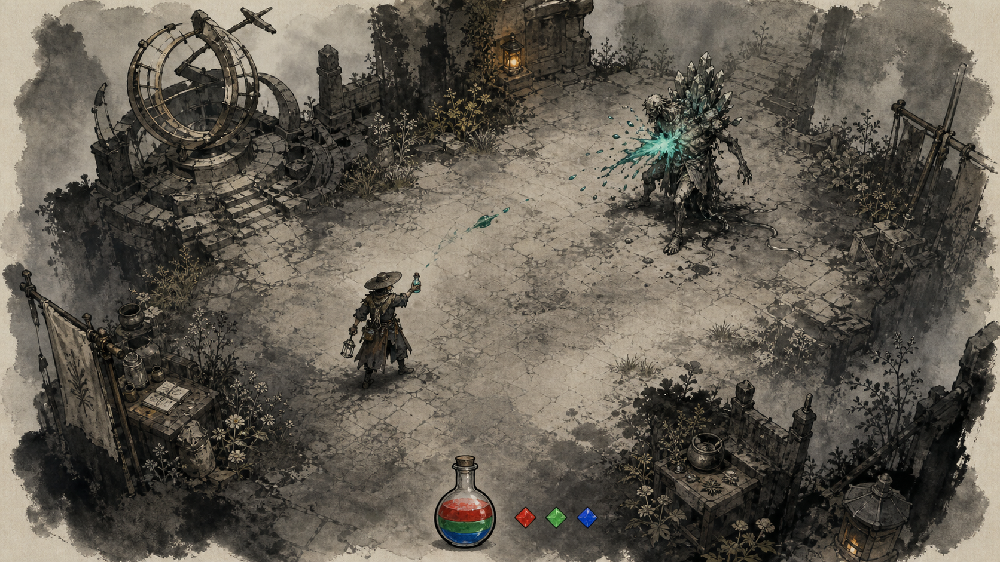

**Use for**

- A fixed top-down three-quarter camera with readable feet and contact points.
- A quiet central movement field framed by denser ruins and vegetation.
- Clear separation between researcher, target, ground, and potion reaction.
- Bottom-center flask priority without a conventional hotbar or combat log.
- Neutral world values interrupted by one compact alchemical color event.

**Do not copy**

- The exact courtyard, observatory instrument, enemy anatomy, or prop placement.
- The exact reagent swatch shapes as final UI controls.
- The amount of crystal growth as a default for every mineral enemy.
- Painted surface texture, amber/cool environment colors, or exact pixel scale.

**Production observations**

- Translate the elevated three-quarter view into the eventual approved gameplay frame.
- Preserve a calm value region around movement and targeting space.
- Use upper-left world lighting and let reactions add only short local light.
- Use eight grayscale values for ordinary world/UI art; reserve saturated color
  for liquid, labeled reagent swatches, and meaningful reaction information.
- Test compact silhouettes in the broader view before fixing production dimensions.

<details>
<summary>Exact generation prompt</summary>

```text
Use case: stylized-concept
Asset type: gameplay visual reference plate for a 2D game
Primary request: Create a wide gameplay north-star frame for CombatAlchemy.
Style/medium: melancholic ink-wash dark fantasy in an invented syncretic folklore world; pure 2D raster painting; charcoal and dry-brush linework on subtly textured paper; hand-painted edges; broad value masses; controlled ink bleed; strong readable silhouettes; deliberate negative space; atmospheric but gameplay-readable.
Scene/backdrop: a ruined mountain observatory courtyard with worn stone, medicinal plants, a broken measuring instrument, cool mist, and quiet traversable ground. Keep the center route visually calm and place denser ruins at the perimeter.
Subject: one cautious forbidden occult field researcher in a weathered asymmetrical coat and broad worn hat, lower-left of center, facing one once-human mineral-bloom enemy upper-right. Show one compact teal potion impact on the enemy.
Camera/composition: fixed top-down three-quarter gameplay view, approximately 40 degrees above ground, wide 16:9 composition, no horizon, no wide-angle distortion. Feet and contact points remain visible. Separate actors clearly from ground.
Interface: one compact glass flask at bottom center with three separated liquid layers; three tiny geometric reagent swatches immediately to its right in red, green, and blue. No enclosing panel, no hotbar, no labels, no numbers, no combat log.
Lighting/mood: upper-left cool overcast key light, one restrained ember practical light, narrow local teal reaction light.
Color palette: soot ink #171411, deep wash #2B2B28, paper bone #E7E0CE, weathered parchment #C9BDA2, mist gray #9BA39D, muted ember gold #C58E3D. Saturated color appears only in small red #E62933, green #33C759, blue #2673F2 reagent layers and the compact teal reaction.
Constraints: strong gameplay-scale silhouettes; readable movement space; researcher uses physical flask and field apparatus, not magic.
Avoid: photorealism, glossy 3D, anime, cel shading, cheerful cozy fantasy, neon full-frame color, generic glowing glyphs, rune circles, magical alphabets, spellcasting hands, staffs, ornate armor, oversized weapons, random spikes, gore, explicit body horror, excessive particles, heavy bloom, muddy silhouettes, isometric grid, card-game UI, cluttered HUD, legible text, letters, numbers, logo, signature, watermark.
```

</details>

### G02: Researcher Sheet

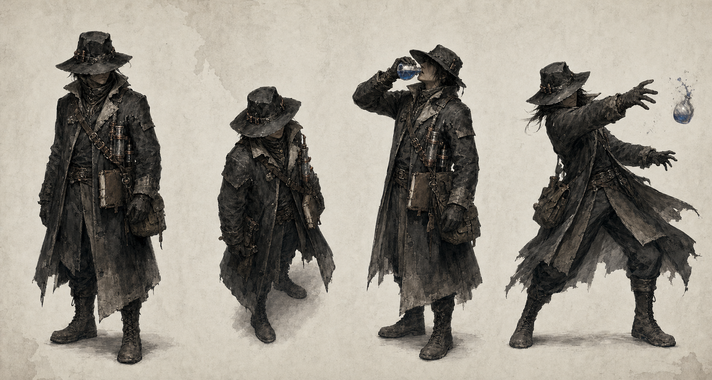

**Use for**

- The broad hat, shoulder line, coat silhouette, and visible flask hand.
- A practical field-research silhouette rather than a conventional wizard.
- Drink and throw silhouettes as future action reference, not new clip scope.
- Equipment based on containers, notes, repairs, ties, gloves, and worn hardware.

**Do not copy**

- Every strap, bottle, coat tear, or pouch as mandatory equipment.
- The exact hat and coat design as a final model sheet.
- The standing pose as the final gameplay perspective reference by itself.

**Production observations**

- Simplify interior costume detail aggressively at gameplay scale.
- Approve four neutral facings at the chosen gameplay scale before producing idle/walk frames
  per facing. Keep both hands empty and locate the bottle through hand markers.
- Use the current model as an API and facing reference, not a demand for skeletal
  assembly, hidden joint overlap, or a separate coat-tail animation pipeline.
- New production deliverables are full-body frames with stable feet and clean
  transparency. Do not generate new articulated body-part atlases.

<details>
<summary>Exact generation prompt</summary>

```text
Use case: stylized-concept
Asset type: character production reference sheet for a 2D game
Primary request: Create a consistent character concept sheet for the CombatAlchemy forbidden occult researcher.
Style/medium: melancholic ink-wash dark fantasy; pure 2D raster; charcoal and dry-brush linework on subtly textured pale paper; broad value masses; selective clean edges at hands, feet, hat, coat hem, and equipment.
Subject: the same practical field researcher shown in four clearly separated studies: a neutral full-body three-quarter standing pose, a top-down three-quarter gameplay idle pose at approximately 40 degrees, a readable drinking pose with flask raised to the mouth, and a readable throwing pose at the release moment. Long asymmetrical weatherproof coat, broad worn hat partly hiding the face, gloves, practical boots, sample satchel, stitched field notebook, leather ties, repaired glass harness, small copper fittings. The flask hand, hat-and-shoulder line, and coat hem must read immediately at small scale.
Composition: wide concept sheet on a quiet paper-bone background with generous empty space between poses. No overlap and no cropped feet. Keep proportions and costume identical across all four studies.
Lighting/mood: upper-left key light, cool neutral ambience, very restrained ember reflection on copper. Soot-black and weathered parchment clothing; only one held liquid uses a small saturated lapis-blue accent.
Constraints: cautious attentive posture, practical scholar before warrior, functional wear and repairs, no written annotations.
Avoid: photorealism, glossy 3D, anime, cel shading, heroic power pose, wizard staff, glowing hands, stars, symbols, runes, chants, generic spellcasting, robes covered in glyphs, ornate armor, oversized weapon, glamorous fashion pose, excessive belts, excessive particles, heavy bloom, text, letters, labels, logo, signature, watermark.
```

</details>

### G06: Researcher Cutout Target

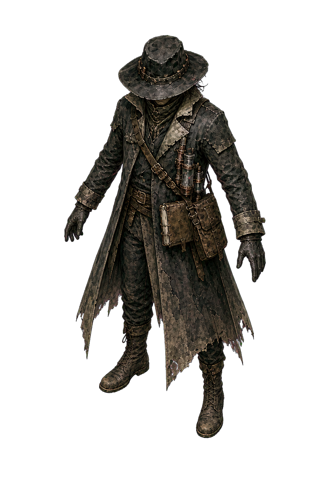

**Use for**

- The historically approved elevated three-quarter view and overall identity.
- Consistent hat, obscured face, weathered coat, glass apparatus, satchel,
  gloves, and boots, simplified into a few readable grayscale pixel clusters.
- Empty hands and readable separation of limbs from the coat.
- Upper-left light and material/value hierarchy, not its colored materials.

**Do not copy**

- Every strap, crack, scale-like fabric mark, or glass fitting as mandatory
  final production detail.
- The flattened target image as a gameplay sprite.
- The single reference view as a substitute for authored directional art.
- Chroma-background pixels or cleanup artifacts.
- Its A-pose, exact proportions, or attachment seams as a sprite-sheet requirement.

**Production observations**

- G06 is a costume/mood reference, not a new pixel approval or active atlas brief.
- The current compact workshop remains skeletal pending sprite-sheet conversion.
- Prioritize the gameplay-scale silhouette over painted texture or equipment density.
- Preserve four separate facings, positive scale, phase, and socket lookup as
  documented in the [PlayerModel guide](../characters/player/README.md), not the
  old bone internals as a new production requirement.

<details>
<summary>Historically approved generation prompt (unchanged)</summary>

```text
Create one detailed forbidden occult field researcher for a pure 2D raster
skeletal cutout game. Match the CombatAlchemy researcher references: broad
weathered hat, face obscured by shadow and scarf, long asymmetrical dark coat,
repaired chest glassware, copper fittings, sample satchel, field notebook,
gloves, and practical boots. Show one full-body elevated top-down
three-quarter view in a neutral mild A-pose, with both arms separated from the
torso and both legs separated enough to expose every future joint. Both hands
are empty. Preserve consistent upper-left lighting, strong gameplay
silhouette, charcoal and ink-wash texture, restrained parchment highlights,
and deliberate wear. Use a perfectly flat solid #ff00ff background. No floor,
shadow, text, labels, grid, watermark, runes, spellcasting, weapon, potion,
glossy 3D, anime rendering, or cropped body parts.
```

</details>

### G03: Enemy Process Families

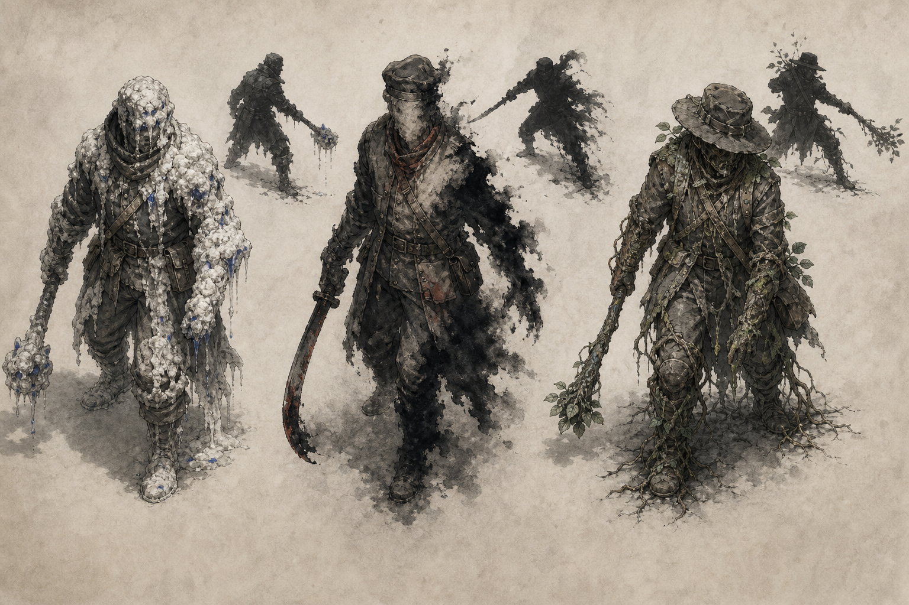

**Use for**

- Enemies altered by one coherent material process instead of random decoration.
- Mineral bloom, ink leaching, and medicinal overgrowth as reusable families.
- One dominant body mass and one directional action silhouette per enemy.
- Small colored clues that can support alchemical observation.

**Do not copy**

- The exact faces, hats, weapons, or clothing shared by these three figures.
- The curved tools shown in the sheet as a required combat direction.
- Dense growth that hides the feet, target area, or attack direction.

**Production observations**

- Reduce detail until each enemy remains identifiable at gameplay zoom.
- Treat the material condition as anatomy and behavior, not surface ornament.
- Reserve the small blue, red, or green clue for intentional mechanics.
- Convert material noise into a few stable pixel shapes. Friend/Foe stay static
  in this presentation pass; expanded enemy families and AI remain future work.

<details>
<summary>Exact generation prompt</summary>

```text
Use case: stylized-concept
Asset type: enemy visual-language reference sheet for a 2D game
Primary request: Create three distinct CombatAlchemy enemy process families as readable gameplay concepts.
Style/medium: melancholic ink-wash dark fantasy; pure 2D raster; charcoal, dry brush, controlled wash, and subtly textured pale paper; restrained detail and strong silhouettes.
Subjects: three clearly separated once-human expedition figures, each transformed by one coherent environmental process rather than random fantasy decoration. Left: mineral bloom, with weighty pale salt crust and limited translucent glass growth following gravity. Center: ink leaching, with edges dissolving into black wash and selected features erased, but anatomy still readable. Right: medicinal overgrowth, with roots and muted leaves following clothing seams and joints. Each figure has one neutral top-down three-quarter gameplay pose and one small dark action silhouette directly behind or beside it. No gore. Keep recognizable feet, attack direction, and body mass.
Composition: wide reference plate with three equal visual zones and generous separation, no labels or text.
Lighting/mood: upper-left neutral key light. Restrained soot, parchment, and mist palette. Use only one tiny clue accent per family: lapis blue for mineral, oxide red for ink residue, verdigris green for overgrowth.
Constraints: practical ruined clothing, one dominant material condition per family, readable at small game scale, melancholy rather than grotesque.
Avoid: photorealism, glossy 3D, anime, zombie gore, body-horror close-up, generic demon horns, random crystals, random spikes, ornate armor, neon glow, magical glyphs, runes, spell effects, excessive particles, muddy silhouettes, text, letters, labels, logo, signature, watermark.
```

</details>

### G04: Flask Interface States

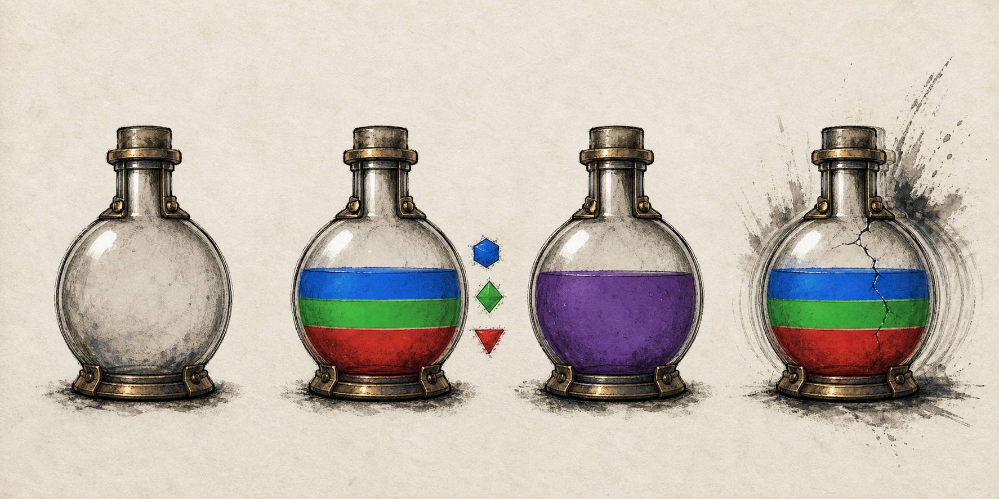

**Use for**

- One identical flask outline across empty, layered, prepared, and rejected states.
- Three mechanically readable liquid bands and adjacent reagent controls.
- A prepared potion becoming one uniform liquid.
- Rejection communicated physically while preserving all mixture layers.

**Do not copy**

- The exact bottle hardware, cork, gem-shaped swatches, or dimensions.
- Permanent glass cracking for every invalid mixture. The shown crack is an upper
  severity reference, not required damage.
- The paper presentation background as an in-game UI panel.

**Production observations**

- Keep the flask compact with adjacent R/G/B swatches; approve its dimensions from gameplay composition.
- Preserve stable dimensions and crisp horizontal layer boundaries in every state.
- Translate painted flare/shake into brief pixel-step motion or an outline flash,
  not smooth scaling, blur, permanent cracks, or a combat log.
- Build labels and accessibility indicators in-engine, never into raster art.

<details>
<summary>Exact generation prompt</summary>

```text
Use case: ui-mockup
Asset type: flask interface visual reference sheet for a 2D game
Primary request: Create four editable-looking visual-state studies for CombatAlchemy's single bottom-center flask interface.
Style/medium: pure 2D raster UI concept painted with ink wash, charcoal, worn glass, restrained metal, and subtly textured paper; clean functional silhouette over decorative detail.
Composition: wide horizontal reference sheet with four separated interface states, each centered in its own open area but with no cards, frames, captions, or written labels. State one: empty dormant flask, visually quiet. State two: unfinished mixture with three crisp horizontal liquid layers stacked from bottom upward in red, green, and blue, plus three small geometric reagent swatches directly to the right. State three: prepared potion blended into one uniform restrained violet liquid, reagent swatches absent. State four: rejected mixture with the same three layers preserved, slight glass stress, offset shake echoes, and a brief dry-brush ink flare. Keep the glass outline identical in all states.
Camera/layout: straight-on interface orthographic view, designed to occupy a compact bottom-center region of a 16:9 game screen. Stable dimensions and generous separation between the four studies.
Lighting/palette: soot ink outline, paper-bone highlights, weathered brass details, narrow upper-left glass glint. Saturated red #E62933, green #33C759, and blue #2673F2 only inside liquid and small swatches.
Constraints: one flask is always the focal object; physical feedback; no readable writing.
Avoid: fantasy hotbar, inventory grid, card layout, ornate frame, giant glowing buttons, rounded mobile panels, nested panels, combat log, recipe names, tutorial copy, generic magic glyphs, rune circles, excessive bloom, full-frame neon, text, letters, numbers, logo, signature, watermark.
```

</details>

### G05: Potion Effect Language

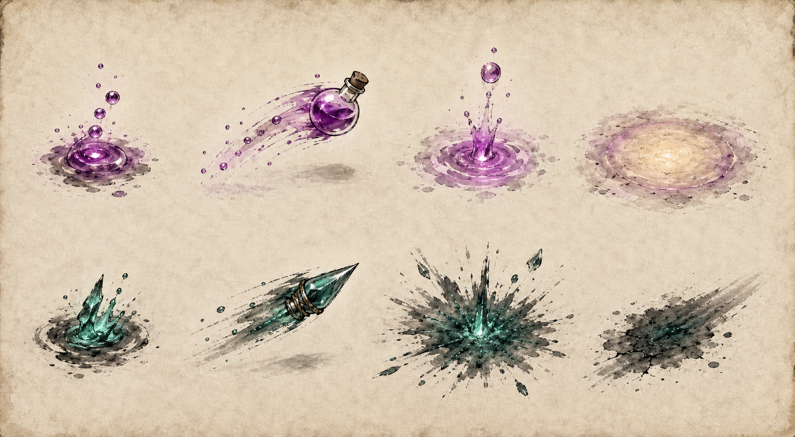

**Use for**

- Four readable stages: anticipation, travel, contact, and consequence.
- Rounded violet-magenta healing motion versus sharper teal damage motion.
- Saturated liquid cores with a brief, sparse outer breakup.
- Small impact footprints that do not hide the target or terrain.

**Do not copy**

- The exact glass fragment count, splash contour, or circular aftermath marks.
- The faceted teal projectile as a requirement that damage potions crystallize.
- The presentation sheet's paper edge as part of gameplay effects.

**Production observations**

- Align feedback to the existing immediate use/impact; do not add an action-event
  delay because the concept plate separates anticipation from contact.
- Keep travel effects compact enough to preserve aim direction.
- Let aftermath marks fade before they accumulate into visual noise.
- Reuse a grayscale bottle with tinted liquid and sparse pixel effect frames.
  Discrete visual orientations must not quantize aim or physical flight.

<details>
<summary>Exact generation prompt</summary>

```text
Use case: stylized-concept
Asset type: potion projectile and impact VFX reference sheet for a top-down 2D game
Primary request: Create two coherent CombatAlchemy potion-effect families, each shown as four separated stages: anticipation, travel, contact, and consequence.
Style/medium: pure 2D raster ink-wash and liquid-physics concept art; charcoal edges, controlled splashes, dry-brush breakup, subtle paper texture; strong readable silhouettes.
Composition: wide reference sheet on quiet weathered paper with two clean horizontal rows and generous space between every effect. No labels, arrows, text, targets, or interface. Top row is a healing-family mixture: restrained violet-magenta liquid gathers into rounded droplets, forms a compact thrown glass flask, makes a small upward suspended wash at contact, then leaves a gentle warm value-return ring. Bottom row is a damage-family mixture: restrained teal liquid forms a sharper compact projectile, breaks into an outward corrosive brush splash at contact, then leaves a brief dark stain with a clear directional edge. Minimal glass fragments.
Camera: top-down three-quarter gameplay view approximately 40 degrees above ground, consistent scale and upper-left key light.
Palette: neutral soot and parchment dominate. Saturated violet-magenta and teal exist only at effect cores and fade quickly into desaturated ink edges.
Constraints: compact readable timing stages, narrow glow, no persistent cloud, no target character, no written annotations.
Avoid: laser beams, generic fireballs, glowing glyphs, rune circles, spellcasting, huge explosions, excessive sparkles, excessive particles, heavy bloom, opaque smoke covering impact, photorealism, glossy 3D, anime, text, letters, labels, logo, signature, watermark.
```

</details>

## Public-Domain Technique References

The local files below are museum-provided public-domain images. Their legal
status does not make their complete compositions part of CombatAlchemy. Keep
source credit in this index and use the works analytically.

For pixel production, translate the named quality into a few value clusters.
Do not import paper texture, etching density, tinted washes, or smooth edges as
the rendering rule. The following source/creator/date/license records remain
unchanged from the stored pack; no new museum downloads occur in this update.

### S01: Concentrated Atmospheric Wash

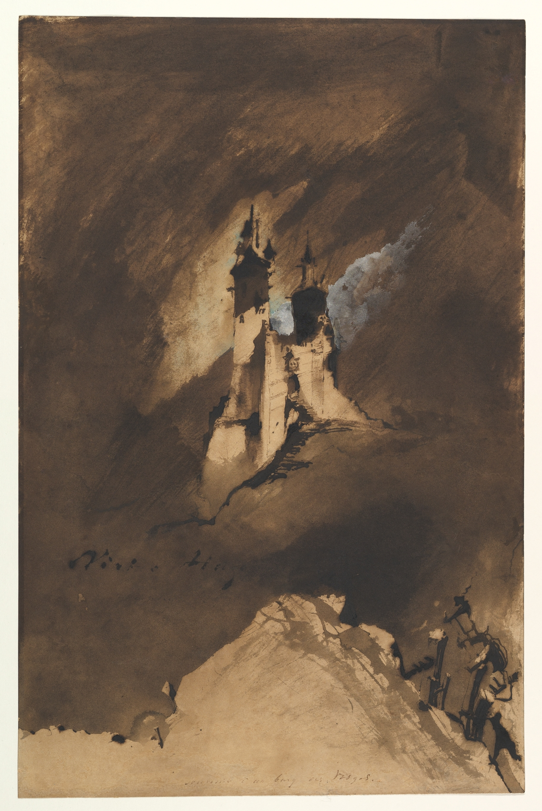

- **Work:** *Souvenir of a Castle in Vosges*
- **Creator:** Victor Hugo
- **Date:** 1857
- **Medium:** Brush and iron gall washes, pen and iron gall ink, white gouache
- **Source:** [The Metropolitan Museum of Art, object 400924](https://www.metmuseum.org/art/collection/search/400924)
- **License:** Public Domain, The Met Open Access

**Use for:** A small hard architectural silhouette held inside a broad field of
soft wash; selective light emerging through darkness; dry and wet edge contrast;
isolation without filling the sheet with detail.

**Do not copy:** The exact castle, mountain path, composition, inscriptions, or
signature. Do not make brown wash the mandatory color of every environment.

### S02: Quiet Value Grouping

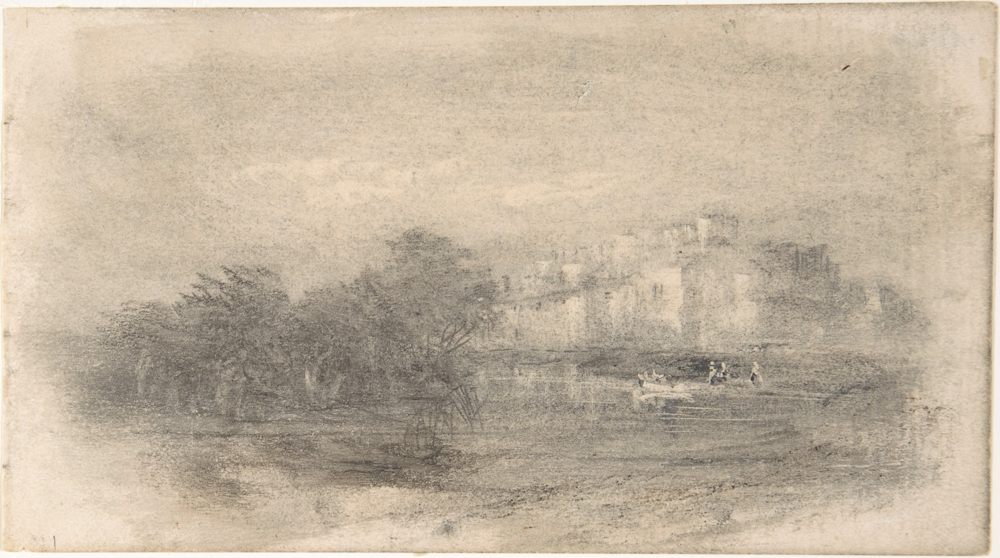

- **Work:** *Landscape*
- **Creator:** Anonymous, British, early 19th century
- **Date:** Early 19th century
- **Medium:** Brush and gray wash with touches of black pen and ink
- **Source:** [The Metropolitan Museum of Art, object 361806](https://www.metmuseum.org/art/collection/search/361806)
- **License:** Public Domain, The Met Open Access

**Use for:** Large quiet areas, compressed distant values, dissolved edges, and
economical marks that imply terrain without describing every surface.

**Do not copy:** The exact estate, horizon, figures, or horizontal composition.
Gameplay routes need stronger ground clarity than this atmospheric study.

### S03: Ruin Structure and Density

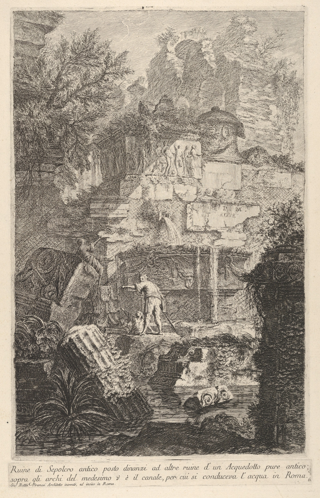

- **Work:** *Plate 6: Ruins of an Ancient Tomb in Front of Ruins of an Ancient Aqueduct*
- **Creator:** Giovanni Battista Piranesi
- **Date:** 1743
- **Medium:** Etching
- **Source:** [The Metropolitan Museum of Art, object 416026](https://www.metmuseum.org/en/art/collection/search/416026)
- **License:** Public Domain, The Met Open Access

**Use for:** Layered masonry, believable collapse, vegetation following structure,
large dark framing masses, and detail concentrated around architectural joints.

**Do not copy:** Roman monuments, reliefs, inscriptions, figures, or the complete
vertical composition. Gameplay environments need calmer traversal zones than the
print's densest passages.

### S04: Silhouette in Darkness

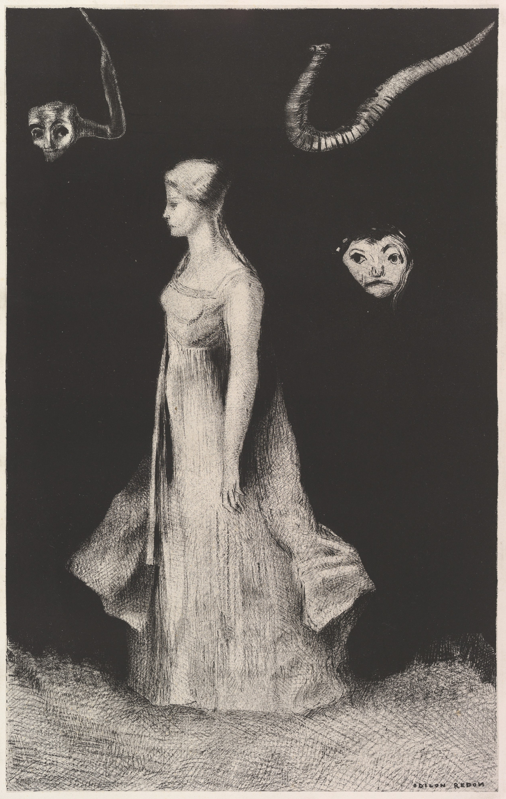

- **Work:** *Haunting*
- **Creator:** Odilon Redon
- **Date:** 1893-94
- **Medium:** Lithograph, fifth and final state
- **Source:** [The Metropolitan Museum of Art, object 340028](https://www.metmuseum.org/art/collection/search/340028)
- **License:** Public Domain, The Met Open Access

**Use for:** Immediate figure-ground contrast, cloth movement, limited internal
detail, and disturbing forms implied by surrounding darkness rather than gore.

**Do not copy:** The figure, floating faces, tendrils, literary subject, or black
background as an enemy design. The reference is about contrast and implication.

### S05: Diagrammatic Apparatus

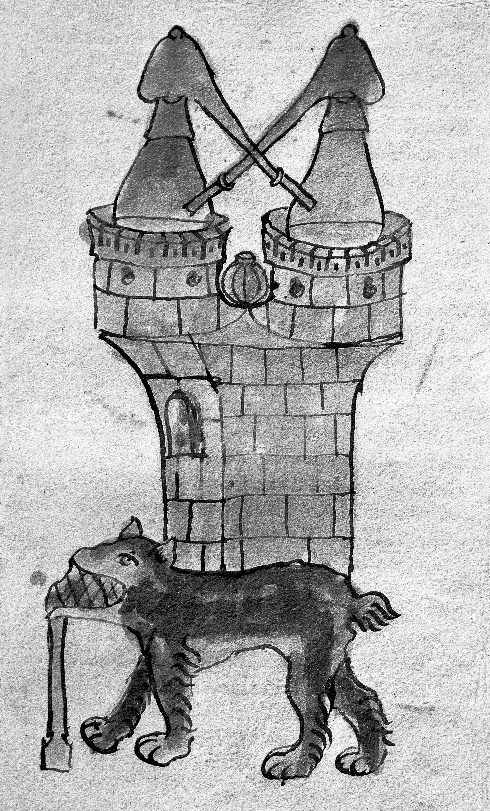

- **Work:** *M0007067: Manuscript Illustration of Alchemical Apparatus*
- **Creator:** Unidentified manuscript artist; photographed by Wellcome in 1940
- **Underlying work:** Possibly a 14th-century alchemical manuscript
- **Date of catalogued image:** 30 July 1940
- **Source:** [Wellcome Collection, work krkc9fkm](https://wellcomecollection.org/works/krkc9fkm)
- **IIIF manifest:** [Wellcome Collection IIIF](https://iiif.wellcomecollection.org/presentation/v2/b33222976)
- **License:** Creative Commons Public Domain Mark 1.0

**Use for:** Apparatus built from connected functional volumes; an immediate read
of vessels, heat, channels, and process; hand-drawn imperfection in technical
objects.

**Do not copy:** The dog, twin-tower silhouette, furnace layout, symbolic reading,
or manuscript line style as world canon. Future props must communicate a plausible
gameplay function and use the project's top-down three-quarter perspective.

## Pack Synthesis

| Aspect | CombatAlchemy target | Primary references |
| --- | --- | --- |
| Medium/grid | Native 2D pixel art on the 1920 x 1080 project canvas with nearest sampling; gameplay grid remains undecided | Current style bible, approval pack, and saved plan |
| Camera | Fixed elevated three-quarter, broad readable view, no isometric tile grid | G01, G02, G03, G05 for perspective only |
| Lighting | Upper-left stepped values; colored light only for small alchemical reactions | G01, G02, G04, G05 for hierarchy |
| Base palette | Eight neutral grayscale values, not painted parchment or tinted mist | S01/S02/S04 for value grouping; style bible for the working ramp |
| Active color | Saturated RGB or prepared-potion color in small mechanical areas | G01, G04, G05 |
| Silhouette | Compact full-body character frames; hat/coat/hand read before detail; exact dimensions require gameplay approval | G02, G06, S04 |
| Environment detail | Quiet routes framed by simple reusable terrain/prop clusters | G01, S02, S03 |
| UI | One compact flask, stable outline, adjacent labeled reagent controls; exact dimensions remain open | G01/G04 for layout, not surface treatment |
| Effects | Grayscale bottle, tinted liquid, compact travel, clear contact, brief pixel aftermath | G01, G05 |
| Props | Functional construction, wear, repair, and process | G02, S05 |

## Review Checklist

- [ ] New work follows native-grid pixel art, not the historical painterly prompts.
- [x] Retained researcher-facing and main-menu samples are explicitly approved.
- [ ] Gameplay composition is decided and approved before gameplay-art production.
- [ ] Ordinary art stays within the agreed eight-value grayscale ramp.
- [ ] Native and integer-enlarged previews show deliberate consistent pixel clusters.
- [ ] Gameplay art uses the shared top-down three-quarter perspective.
- [ ] Upper-left lighting remains consistent unless an exception is documented.
- [ ] The primary silhouette reads at its actual source size, not only enlarged.
- [ ] Saturated color communicates alchemy instead of tinting the whole image.
- [ ] Traversal, target, and interface areas remain visually calm enough to read.
- [ ] No historical symbol or complete cultural design is copied without research.
- [ ] No runes, chants, spellcasting pose, magic alphabet, or generic glowing glyphs appear.
- [ ] Functional text and accessibility labels are authored in Godot, not baked into art.
- [ ] Generated concepts are rebuilt and cleaned before production use.
- [ ] Character frames, hand markers, and empty hands support one separate bottle.
- [ ] The historical references and exact prompts remain attributed and unchanged.
