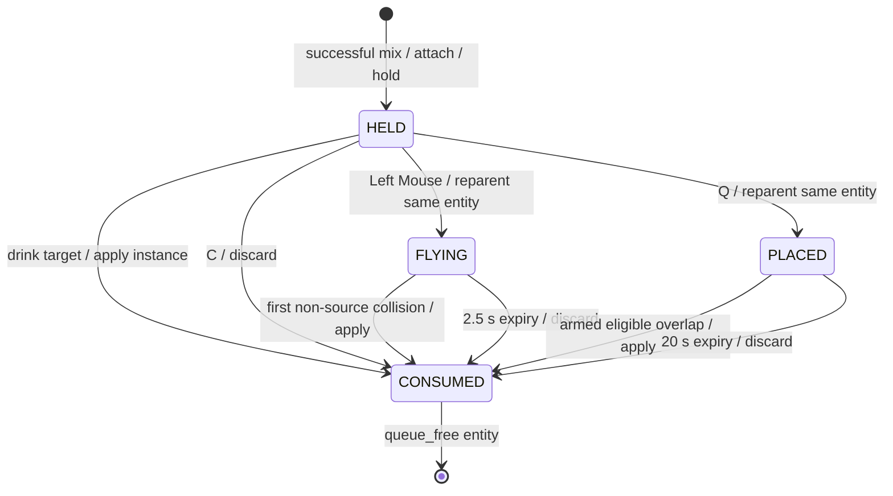

# Project Architecture

> Status: Technical source of truth
> Documentation review: 2026-09-16; small-flask brewing and two enemy archetypes implemented
> Automated verification: current results are recorded below
> Creative companion: [Style and Vision](./STYLE_AND_VISION.md)
> Player model guide: [PlayerModel](../characters/player/README.md)
> Visual reference pack: [Art Reference Index](./ART_REFERENCE_INDEX.md)
> Approved presentation plan: [Pixel-Art Conversion](./plannings/plans/2026-09-12-pixel-art-conversion.md)
> Approved gameplay direction: [Brewing, Vessels, and Strategic Placement](./plannings/specs/2026-09-15-potion-brewing-vision-design.md)

## Project Scope

CombatAlchemy is a Godot 4.x GDScript prototype. The active game is a
real-time potion combat sandbox reached from the main menu. The current slice
has player movement and collision, actors with reusable health components,
capability-based potion effects, one held physical potion, immediate drinking,
throwing and proximity placement,
hold/release/settle small-flask brewing, mixer UI, scene transitions, music,
settings, pause navigation, and two disposable enemy archetypes for combat testing.

There is no exploration layer, victory state, defeat state,
permanent save data, reagent inventory, or automatic combat-completion return
flow. The next technical goals, in order, are:

1. Review and tune the implemented animated main menu; decide gameplay
   composition before converting gameplay presentation or fixing gameplay asset sizes.
2. Playtest and tune the implemented small-flask hold/release/settle interaction
   before adding more recipes or vessel tiers.
3. Tune the Pursuer and Skirmisher behaviours, then add obstacle-aware
   navigation only when arena geometry makes it useful.
4. Add reagent pickups and limited runtime carrying without permanent storage.
5. Add selected world objects with focused capabilities that existing potion
   effects can query.
6. Add victory, defeat, and encounter reset around the proven combat loop.

Exploration, refuge, discovery records, persistence, richer enemy perception,
group behavior, and full expedition routing remain future vision rather than
current runtime architecture. See [Project Goals and Scope](./STYLE_AND_VISION.md#project-goals-and-scope)
for the layered product direction.

Larger vessels, staged recipes, transformation, dormant placement with deliberate
activation, and prepared-potion storage are approved future direction, not new
runtime features. See [Brewing Evolution](#implemented-small-flask-and-future-brewing-evolution)
for the boundaries that a later implementation must preserve.

The code favors scene-local components. The only autoloads are application
shell services: settings, music, transitions, and scene routing. Potion data,
health, input translation, UI rendering, player presentation, and potion entity
motion remain independent of those autoloads.

## Presentation Migration Status

The [saved conversion plan](./plannings/plans/2026-09-12-pixel-art-conversion.md)
changes presentation, not the real-time alchemy concept. Its main-menu stage is
now implemented through the separate
[animated menu plan](./plannings/plans/2026-09-12-animated-main-menu-rebuild.md).
The `640 x 360` approval sample remains a composition reference only. The active
menu uses a native `1920 x 1080` redraw and scene-authored controls and layers.
Gameplay composition and production asset dimensions remain undecided.

| Boundary | Current implementation | Approved replacement |
| --- | --- | --- |
| Display | Native `1920 x 1080` project canvas with nearest texture filtering | Keep `1920 x 1080` as the permanent project canvas; validate responsive layout at other 16:9 and wider windows |
| Camera and art scale | Player camera at default zoom `(1, 1)` with smoothing; existing world units | Undecided until gameplay composition is approved; do not infer world scale from the menu |
| Player visual | 15-bone skeleton, geometric parts, AnimationPlayer/AnimationTree | Pixel-art replacement remains planned, but production cell and sheet dimensions are not fixed |
| Animation | Four authored idle/walk families and skeletal interpolation | Four authored facings and low-frame playback remain preferred; exact frame budget follows gameplay-composition approval |
| Direction | Positive-scale front/back/side-left/side-right, phase-aware turns and 0.10 hysteresis | Preserve facing rules, gait phase, idle retention, and anatomical hands; no mirroring or image crossfades |
| Sockets | Markers beneath hand bones; a held entity follows `hand_right` | Stable `hand_left`/`hand_right` lookup with per-frame marker positions; the bottle remains separate from character art |
| Workshop | Same model, movement room, readouts, bone overlay | Same model/workflow with frame bounds and socket guides; no separate production rig |
| Sandbox and UI | Passive Friend, H/J-spawned Pursuer/Skirmisher, plain arena, geometric bottle/flask, rebuilt animated main menu, existing pause/settings | Gameplay composition and asset sizes are intentionally undecided; retain flask-first interaction and hybrid detail |
| Transitions | Snapshot-based ink reveal | Pixel-grid reveal with unchanged duration/input-blocking/completion contract |

### Contracts to Preserve

- Keep `PlayerModel.set_motion()`, `set_facing_direction()`, `reset_to_idle()`,
  `set_playback_speed()`, `get_facing()`, `get_locomotion_state()`, `get_socket()`,
  and its facing/locomotion signals. Callers must not rely on bone paths.
- Plan to add `set_debug_guides_visible()` and retain
  `set_debug_bones_visible()` as a compatibility wrapper. The new method does
  **not** exist yet and is therefore absent from the current API tables.
- Keep physics coordinates, collision shapes, movement speed, health, recipes,
  projectile trajectories, placement rules, and current immediate potion use.
  Render quantization must not quantize physics or continuous mouse aim.
- Preserve `PotionRecipeData` -> `PotionInstance` -> `PotionEntity` ownership,
  `HeldPotionSlot`, delivery-independent effects, and one-use consumption.
- Preserve autoload names, registered scene paths, music, audio buses,
  `user://settings.cfg`, pause, and scene routing. No new managers are required.
- Keep existing art/music as source material. Do not add AI, inventory, pickup,
  expeditions, or new diegetic menu interactions during this conversion.

The produced researcher and menu samples remain approved references. The menu
sample now guides composition only; it is not the runtime background. Gameplay
composition remains undecided and must be designed separately before any
gameplay-art conversion. Exact character, terrain, and flask dimensions are not
production contracts. Bone-specific tests will need frame/socket replacements;
the existing gameplay suites retain their contracts.

## Current Runtime Flow

```text
project.godot
  -> mainmenu/StartMenu.tscn
	  -> MainMenu: New Game
		  -> GameManager.start_new_game()
			  -> SceneTransition.transition_to_scene()
				  -> combat/CombatScene.tscn

CombatScene
  -> PlayerActor (world movement, camera, collision, health)
	  -> PlayerModel (15-bone visuals, four-facing idle/walk, sockets)
  -> PotionCombatController
	  -> PotionInput: Space press/release intent
	  -> PotionMixer: layers + recipe match
		  -> BrewingReaction: agitate -> settle/recover -> complete
		  -> potion_prepared(PotionInstance) after successful settling
		  -> one PotionEntity attaches to PlayerModel.hand_right
		  -> HeldPotionSlot retains the instance/entity pair
			  -> drink(Player): direct PotionImpactContext
			  -> throw_into(Arena/PotionEntities, origin, direction): FLYING
			  -> place_into(Arena/PotionEntities, position): PLACED
				  -> eligible collision creates PotionImpactContext
			  -> PotionInstance.apply() -> PotionEffectResolver
				  -> recipe effects query subject components
  -> EnemyTestSpawner: H/J spawn requests
	  -> Pursuer: notice -> chase -> melee windup -> recovery
	  -> Skirmisher: approach/retreat distance band -> ranged windup -> projectile

Play Current Scene
  -> characters/player/PlayerModelWorkshop.tscn
```

Escape opens `ui/PauseMenu.tscn`. Resume returns to the same scene; Main Menu
routes through `GameManager`; Quit calls `GameManager.quit_game()`.

## Directory Ownership

| Path | Ownership |
| --- | --- |
| `characters/player/` | Canonical compact player model, locomotion library, sockets, workshop, and model guide. |
| `combat/CombatScene.tscn` | Active potion sandbox composition and dependency wiring. |
| `combat/actors/` | Player movement, actor capabilities, neutral impact hitboxes, collision, cameras, and world health bars. |
| `combat/enemies/` | Reusable enemy actors, profiles, local sensing/movement, separate tactical brains, attacks, projectiles, and sandbox spawning. |
| `combat/potions/` | Reagent constants, recipes, unfinished mixer layers, runtime potion instances, one held slot, delivery IDs, and physical potion entities. |
| `combat/potions/brewing/` | Deterministic reaction simulation, editable vessel tuning, and small-flask implementation notes. |
| `combat/potions/effects/` | Stateless effect contracts, delivery context, resolver, and effect implementations. |
| `combat/potions/resources/` | Editable default recipe book and recipe resources. |
| `combat/ui/` | Flask rendering and bottom-center mixer controls. |
| `shared/alchemy/` | Project-wide semantic Charged Neon palette data shared by potion UI, recipes, menus, and VFX. |
| `vfx/reactive_crystal/` | Reusable crystal pile and shatter scenes plus an isolated five-color workshop. The shatter scene is not wired into active impacts yet. |
| `globals/` | Autoload services and scene-level music declarations. |
| `globals/resources/` | Scene registry and project information resources. |
| `mainmenu/` | Native 1920 x 1080 animated backdrop, reusable text commands, inline stepped settings, version metadata, and retained pause-settings scene. |
| `ui/` | Reusable pause menu. |
| `tests/` | Retained player/potion suites plus headless main-menu and reactive-crystal contracts. |
| `docs/` | Active architecture, visual direction, and local art references. |
| `docs/plannings/` | Dated designs/plans; historical entries carry scope notices. The 2026-09-12 conversion plan owns presentation migration; the 2026-09-15 brewing design records current small-flask and future vessel direction. |
| `music/`, `sprites/`, `extra/` | Audio, remaining images, fonts, and shaders. |

## Scene Composition

### StartMenu And MainMenu

`mainmenu/StartMenu.tscn` remains the registered entry scene. It composes the
active `MainMenu.tscn` and the existing `LevelMusic` request for
`music/MainMenuNew.mp3`. Settings are now an inline view inside `MainMenu`; the
pause-specific `mainmenu/Settings.tscn` is no longer instanced by StartMenu and
remains owned by `ui/PauseMenu.tscn`.

`mainmenu/MainMenu.tscn` is authored on the permanent `1920 x 1080` project
canvas. It contains:

- `MainMenuBackdrop`: the approved grayscale laboratory base, two integer-wrapped
  cloud strips, two foliage loops, three pinned-note loops, three table crystal
  piles, three smaller shelf deposits, and editor-facing speed/glow tuning;
- a scene-authored two-line title and reusable text commands for New Game,
  Settings, and Quit;
- `MainMenuSettingsView`, which replaces only the command list and maps Music
  and SFX between persisted decibels and ten visible steps;
- `VersionStone`, now an unframed version/build/current-focus text block.

Opening Settings does not reload or pause the backdrop. Back or Escape closes
the inline view and restores focus to Settings. New Game still forwards the
transition duration before routing through `GameManager`.

### CombatScene

`combat/CombatScene.tscn` is the registered combat scene. Its root owns
`PotionCombatController` and composes:

- `Arena/Player`: `combat/actors/PlayerActor.tscn`, including
  `PlayerCombatController`, `characters/player/PlayerModel.tscn`, collision,
  following camera, `HealthComponent`, neutral `ImpactHitbox`, and
  `ActorHealthBar`.
- `Arena/Friend`: passive `TargetActor.tscn` potion-testing target with starting health.
- `Arena/EnemyTestSpawner`: H/J developer spawner with authored Pursuer/Skirmisher
  markers, an `Enemies` runtime parent, and an `EnemyProjectiles` runtime parent.
  Combat deliberately begins without hostiles.
- `Arena/PotionEntities`: runtime parent for flying and placed potion entities.
  A newly mixed entity is added here before attachment; while held, its parent
  is the PlayerModel's `hand_right` socket. Release reparents the same node here.
- `Systems/PotionInput`: maps Input Map actions to potion intent signals,
  including distinct Space press and release events.
- `Systems/PotionMixer`: owns unfinished reagent layers and recipe matching.
  Its authored `BrewingReaction` child owns progress, energy, settling, and
  overreaction recovery. The mixer emits a new `PotionInstance` only after a
  successful settle.
- `Systems/HeldPotionSlot`: holds references to exactly one instance/entity pair.
- `UI/PotionMixerUI`: displays layers, geometric reaction motion, current and
  predicted-settle markers, success range, recovery foam, prepared color, and
  reagent controls.
- `UI/PauseMenu`: reusable pause and settings overlay.
- `LevelMusic`: requests `music/CombatNew.mp3` from `MusicManager`.

Player and Friend remain present and targetable at zero health. Healing can
raise them above zero. Spawned enemies cancel their attack and remove
themselves at zero health. No component changes scenes or decides victory or
defeat.

### Enemy Actors

`Pursuer.tscn` and `Skirmisher.tscn` are independent `CharacterBody2D`
actors. Both own a body shape, `HealthComponent`, neutral `ImpactHitbox`,
world health bar, `EnemyMovement`, `EnemySenses`, an `EnemyAttack`, and
an archetype-specific brain. An actor receives its target explicitly from the
spawner; it does not scan the scene or rely on an autoload.

The Pursuer notices the Player within 900 pixels, chases until it is within
96 pixels, and commits one 10-damage sector strike after a 0.50-second windup.
The captured aim and 110-pixel / 120-degree hit sector make the strike
dodgeable. It has 90 HP and 0.85-second recovery.

The Skirmisher has 60 HP. It approaches beyond 480 pixels, retreats inside
280 pixels until 340 pixels, and holds/shoots at 420 pixels. After a
0.65-second windup it releases an 8-damage, fixed-direction dart; the dart
does not home, passes ignored actors, stops on a world body or Player, and
expires after 3.5 seconds. Recovery lasts 1.20 seconds.

### PlayerActor

`combat/actors/PlayerActor.tscn` owns active player world behavior. The root
`CharacterBody2D` runs `PlayerCombatController.gd`; it contains the canonical
`PlayerModel`, collision, camera, health, neutral impact hitbox, and health
bar. World velocity is passed directly to `PlayerModel.set_motion()`. Throw
origin is the model's `hand_right` socket, with the actor position as a
defensive fallback.

`get_potion_holder()` returns the `hand_right` `Marker2D`, or `null` if absent.
A missing holder rejects a new bottle; only throw-origin lookup falls back to
the actor position. `get_place_position()` is the player world position plus
`get_throw_direction() * place_distance` (default `64.0` pixels). The direction
is measured from the right hand toward the global mouse, with rightward fallback.

### PotionEntity

`combat/potions/PotionEntity.tscn` is one `Node2D` for the entire bottle lifetime.
It owns `BottleVisual` (`Polygon2D`), `Outline` (`Line2D`),
`FlightArea/CollisionShape2D`, `SweepCast` (`ShapeCast2D`), and
`PlacementTrigger/CollisionShape2D`. The flight circle radius is `13` pixels;
the trigger radius is `42` pixels. Flight and sweep masks are `3` (world and
actor layers); placement mask is `2` (actor layer). Both areas have layer `0`.
Held and consumed states disable monitoring and the sweep; flying enables
flight monitoring and sweep; placed enables only placement monitoring.

These are runtime parenting and reference responsibilities, not persistent
inventory or changes to the Godot serialization `owner` property.

### PlayerModel

`characters/player/PlayerModel.tscn` owns presentation only. Its authored
15-bone `Skeleton2D`, geometric body parts, two hand sockets,
`AnimationPlayer`, and `AnimationTree` are directly editable. Four separate
facings (`front`, `back`, `side_left`, `side_right`) each provide idle and walk
clips through `characters/player/PlayerLocomotionLibrary.tres`. Horizontal
facings use authored positive-scale states; they are not mirrored at runtime.

Stable socket IDs are `hand_left` and `hand_right`. Consumers call
`get_socket()` instead of depending on internal bone paths. The complete bone
tree and separate planned sprite-sheet workflow are in the
[PlayerModel guide](../characters/player/README.md). The 15-bone hierarchy
describes current internals, not a restriction on the approved visual conversion.

### PlayerModelWorkshop

`characters/player/PlayerModelWorkshop.tscn` is the isolated Play Current
Scene workshop. `PlayerModelWorkshopActor.gd` owns movement and collision;
`PlayerModel.gd` remains presentation-only; `PlayerModelWorkshop.gd` keeps the
facing, locomotion, and debug-bone controls synchronized. The workshop is not
registered in `project.godot` and is not a runtime dependency of combat.

## Retained Script Reference

Public methods below exclude Godot lifecycle callbacks and private methods
whose names begin with an underscore. `None` means the script intentionally
exposes no item in that category.
These are current script interfaces; future pixel rendering does not add or
remove methods from this reference until it is implemented.

### Player And Combat

| Script | Responsibility | Dependencies | Signals | Exports | Public methods |
| --- | --- | --- | --- | --- | --- |
| `characters/player/PlayerModel.gd` | Own compact visual facing, locomotion blending, sockets, and debug bones. | Authored model nodes, required clips, and `AnimationTree` state machines. | `facing_changed`, `locomotion_changed` | None | `set_motion()`, `set_facing_direction()`, `reset_to_idle()`, `set_playback_speed()`, `set_debug_bones_visible()`, `get_facing()`, `get_locomotion_state()`, `get_socket()` |
| `characters/player/PlayerModelWorkshop.gd` | Synchronize workshop status controls with the canonical model. | Workshop `PlayerModel`, labels, and bones toggle. | None | None | None |
| `characters/player/PlayerModelWorkshopActor.gd` | Move and collide the workshop actor while forwarding velocity to the model. | Input Map movement actions and a model exposing `set_motion()`. | None | `movement_speed`, `player_model_path` | None |
| `combat/PotionCombatController.gd` | Coordinate input, unfinished mixing, held ownership, UI, and entity delivery. | `PotionInput`, `PotionMixer`, `HeldPotionSlot`, `PotionMixerUI`, `PlayerCombatController`, entity parent and scene. | None | `potion_input_path`, `potion_mixer_path`, `held_potion_slot_path`, `potion_mixer_ui_path`, `player_combat_controller_path`, `potion_entities_parent_path`, `potion_entity_scene` | None |
| `combat/PotionInput.gd` | Translate named Input Map actions into potion intent and guarantee paired agitation release on key-up, pause, Escape, or focus loss. | Project input actions, `PotionReagent`, `PotionDelivery`. | `mixer_toggle_requested`, `reagent_requested(reagent: StringName)`, `agitation_started`, `agitation_released`, `potion_use_requested(delivery_method: StringName)`, `remove_reagent_requested`, `clear_mixture_requested` | None | None |
| `combat/actors/PlayerCombatController.gd` | Move the active player and provide holder and world-space delivery geometry. | Movement actions and `PlayerModel.set_motion()`/`get_socket()`. | `movement_changed(current_velocity: Vector2)` | `speed`, `player_model_path`, `place_distance` (`64.0`) | `set_movement_locked()`, `is_movement_locked()`, `get_potion_holder() -> Marker2D`, `get_throw_origin() -> Vector2`, `get_throw_direction() -> Vector2`, `get_place_position() -> Vector2` |
| `combat/actors/HealthComponent.gd` | Own bounded actor health. | None. | `health_changed`, `depleted`, `damaged` | `max_health`, `current_health` | `take_damage()`, `heal()`, `reset_health()`, `get_health_ratio()` |
| `combat/actors/ImpactHitbox.gd` | Map a collision-only area to the entity whose components effects may query. | Configured subject node. | Inherited `Area2D` signals | `effect_subject_path` | `get_effect_subject()` |
| `combat/actors/ActorHealthBar.gd` | Display an actor name and exact world-space health values. | Configured `HealthComponent` and scene labels/bar. | None | `display_name`, `health_component_path` | None |
| `combat/enemies/EnemyProfileData.gd` | Store immutable Inspector tuning for one enemy archetype. | None. | None | Health, awareness, movement, attack, range, and projectile tuning. | `is_valid() -> bool` |
| `combat/enemies/EnemyActor.gd` | Wire local enemy capabilities, order sensing/decision/attack/movement, and remove depleted enemies. | Valid profile, health/hitbox, movement, senses, brain, attack, and body shape. | None | `profile` | `set_target(target: Node2D)` |
| `combat/enemies/EnemySenses.gd` | Track one assigned living target with notice/disengage hysteresis. | Explicit target and `EnemyProfileData`. | None | None | `set_target(target: Node2D)`, `refresh(origin, profile)`, `get_target() -> Node2D` |
| `combat/enemies/EnemyMovement.gd` | Convert a local movement request into `CharacterBody2D.move_and_slide()`. | Explicit body and speed. | None | None | `configure(body, speed)`, `move_in_direction(direction)`, `stop()`, `advance()` |
| `combat/enemies/PursuerBrain.gd` | Choose idle, chase, or melee attack for the close-range archetype. | Configured senses, movement, attack, profile. | None | None | Inherited `configure()`, `tick()`, `get_state()` |
| `combat/enemies/SkirmisherBrain.gd` | Choose approach, retreat, hold, or ranged attack using stable distance bands. | Configured senses, movement, attack, profile. | None | None | Inherited `configure()`, `tick()`, `get_state()` |
| `combat/enemies/EnemyAttack.gd` | Own cancellable windup/recovery timing and authored telegraph feedback. | Actor, profile, authored `Telegraph` and `ImpactFlash`. | `executed` | None | `configure()`, `try_start(target) -> bool`, `advance(delta)`, `is_busy() -> bool`, `cancel()` |
| `combat/enemies/MeleeEnemyAttack.gd` | Resolve one captured-direction, range, and sector-checked strike. | Base attack and target `HealthComponent`. | Inherited `executed` | None | Inherited attack API. |
| `combat/enemies/RangedEnemyAttack.gd` | Release one fixed-direction projectile from a captured attack aim. | Base attack, configured `EnemyProjectile` scene, world projectile parent. | Inherited `executed` | `projectile_scene` | Inherited attack API. |
| `combat/enemies/EnemyProjectile.gd` | Sweep a fixed-direction enemy dart to Player/world collision or expiry. | Scene-authored `ShapeCast2D`, assigned target/source, target direct-child `HealthComponent`. | None | None | `launch(origin, direction, target, source, damage, speed, lifetime)` |
| `combat/enemies/EnemyTestSpawner.gd` | Handle H/J sandbox spawns and reject occupied markers. | Player, enemy/projectile parents, two markers, and two enemy scenes. | None | Paths, scenes, `spawn_clearance` | None |
| `shared/alchemy/AlchemyPaletteData.gd` | Provide the project-wide semantic Charged Neon reagent and prepared-potion colors. | None. | None | `red_color`, `green_color`, `blue_color`, `health_color`, `damage_color` | `get_color(color_id: StringName) -> Color` |
| `combat/potions/PotionReagent.gd` | Define supported reagent IDs and resolve their shared colors. | `ChargedNeonPalette.tres`. | None | None | Static `is_valid()`, `get_color()` |
| `combat/potions/PotionRecipeData.gd` | Describe one exact three-layer potion recipe and its composable effects. | `PotionReagent`, `PotionEffectData`. | None | ID, name, three counts, effects, mixed color | `is_valid()`, `matches_layers()` |
| `combat/potions/PotionRecipeBookData.gd` | Find an order-independent recipe match. | `PotionRecipeData` resources. | None | `recipes` | `find_match()` |
| `combat/potions/brewing/BrewingProfileData.gd` | Store editable timing, success-window, cooldown, and recovery values for one vessel. | None. | None | `energy_ramp_time`, `progress_rate`, `energy_dissipation_time`, `success_min_progress`, `success_max_progress`, `overreaction_cooldown`, `recovery_progress` | `is_valid() -> bool` |
| `combat/potions/brewing/BrewingReaction.gd` | Simulate deterministic reaction progress and energy independently of recipes, UI, entities, and effects. | Valid `BrewingProfileData`. | `state_changed(state)`, `reaction_changed(progress, energy, predicted_settled_progress)`, `completed`, `overreacted`, `recovered` | `profile` | `start_agitation() -> bool`, `release_agitation()`, `advance(delta)`, `cancel()`, `get_state()`, `get_progress()`, `get_energy()`, `get_predicted_settled_progress()`, `is_editable()` |
| `combat/potions/PotionMixer.gd` | Own unfinished layers, validate recipes, coordinate one reaction, and create one runtime instance after successful settling. | `PotionReagent`, configured `PotionRecipeBookData`, authored `BrewingReaction`. | `layers_changed(layers)`, `potion_prepared(potion)`, `mix_rejected(layers)`, `mixture_cleared`, `brewing_changed(state, progress, energy, predicted_settled_progress)`, `brewing_overreacted`, `brewing_recovered` | `max_layers` (`3`, clamped `1..3`), `recipe_book`, `brewing_reaction_path` | `add_reagent()`, `remove_last()`, `clear()`, `start_brewing()`, `release_brewing()`, brewing getters, `get_layers()` |
| `combat/potions/PotionInstance.gd` | Own one valid recipe reference, copied creation layers, and one-shot consumption state. | `PotionRecipeData`, `PotionImpactContext`, `PotionEffectResolver`. | None | None | Static `create(recipe: PotionRecipeData, layers: Array[StringName]) -> PotionInstance`; `get_recipe() -> PotionRecipeData`, `get_created_layers() -> Array[StringName]`, `get_color() -> Color`, `is_valid() -> bool`, `is_consumed() -> bool`, `apply(context: PotionImpactContext) -> int`, `discard() -> bool` |
| `combat/potions/HeldPotionSlot.gd` | Retain the one currently held instance/entity pair. | `PotionInstance`, `PotionEntity`. | `potion_changed(potion: PotionInstance)` (null on clear) | None | `hold(potion: PotionInstance, entity: PotionEntity) -> bool`, `clear() -> void`, `has_potion() -> bool`, `get_potion() -> PotionInstance`, `get_entity() -> PotionEntity` |
| `combat/potions/PotionEntity.gd` | Own one bottle through `HELD`, `FLYING`, `PLACED`, `CONSUMED` states. | `PotionInstance`, `PotionDelivery`, `PotionImpactContext`, scene visuals and collision nodes. | `state_changed(state: State)`, `resolved(context: PotionImpactContext, applied_effect_count: int)` | `flight_speed` (`650.0` px/s), `flight_lifetime` (`2.5` s), `arming_delay` (`0.35` s), `placed_lifetime` (`20.0` s) | `initialize(potion: PotionInstance, source: Node) -> bool`, `attach_to(holder: Node2D) -> bool`, `drink(target: Node) -> bool`, `throw_into(world_parent: Node2D, origin: Vector2, direction: Vector2) -> bool`, `place_into(world_parent: Node2D, world_position: Vector2) -> bool`, `discard() -> bool`, `get_state() -> State`, `get_potion() -> PotionInstance` |
| `combat/potions/PotionDelivery.gd` | Share `StringName` delivery constants `DRINK = &"drink"`, `THROW = &"throw"`, `PLACE = &"place"`. | None. | None | None | None |
| `combat/potions/effects/PotionEffectData.gd` | Define the stateless base contract and application result values for one effect. | `PotionImpactContext`. | None | None | `is_valid()`, `apply()` |
| `combat/potions/effects/HealthPotionEffectData.gd` | Heal or damage an impacted subject when it exposes `HealthComponent`. | `PotionEffectData`, `PotionImpactContext`, `HealthComponent`. | None | `operation`, `amount` | `is_valid()`, `apply()` |
| `combat/potions/effects/PotionImpactContext.gd` | Carry delivery source, subject, collider, world geometry, and direct-child capability lookup. | Impacted scene nodes. | None | None | `configure()`, `is_valid()`, `find_component()` |
| `combat/potions/effects/PotionEffectResolver.gd` | Apply every valid recipe effect and count supported applications. | `PotionRecipeData`, `PotionEffectData`, `PotionImpactContext`. | None | None | `apply_recipe()` |
| `combat/ui/FlaskView.gd` | Render scene-authored layers, agitation/settling motion, progress prediction, success range, cooldown foam, prepared liquid, and rejection feedback. | Authored polygons/lines and `PotionReagent` colors. | None | None | `set_layers()`, `show_brewing()`, `show_mixed()`, `show_failure()`, `reset_view()` |
| `combat/ui/PotionMixerUI.gd` | Present reagent controls and reflect editable, brewing, recovery, and prepared states. | `FlaskView` and three reagent buttons. | `reagent_selected` | None | `set_open()`, `show_mixing()`, `show_brewing()`, `show_ready()`, `show_mix_failure()`, `reset_view()`, `are_reagent_buttons_enabled()` |
| `vfx/reactive_crystal/ReactiveCrystalPile.gd` | Present one editable crystal deposit with settled geometry, localized glow, reflection, and low-simmer motes. | `AlchemyPaletteData`, authored polygons, `GPUParticles2D`. | None | `palette`, `color_id`, `crystal_color`, `glow_strength`, `motion_strength`, `mote_amount`, `random_seed` | `set_crystal_color()`, `set_glow_strength()`, `set_emitting()` |
| `vfx/reactive_crystal/PotionShatterParticles.gd` | Play and self-retire a color-configurable one-shot potion shatter visual. It does not resolve impacts or effects. | Two authored `GPUParticles2D` groups and cleanup timer. | None | `glow_strength`, `cleanup_delay` | `play_burst(world_position, color, incoming_direction)` |
| `vfx/reactive_crystal/ReactiveCrystalVFXWorkshop.gd` | Preview all five palette colors and manually trigger isolated shatter bursts. | Shared palette, pile scene, shatter scene, five authored controls. | None | None | None |

### Application Shell

| Script | Responsibility | Dependencies | Signals | Exports | Public methods |
| --- | --- | --- | --- | --- | --- |
| `globals/GameManager.gd` | Route high-level actions to registered scenes. | `SceneRegistryData`, `SceneTree`, optional `SceneTransition`. | None | `use_ink_transition`, `scene_registry` | `start_new_game()`, `go_to_main_menu()`, `quit_game()` |
| `globals/Settings.gd` | Persist and apply Music/SFX bus levels. | `AudioServer`, `user://settings.cfg`. | None | None | `set_music_db()`, `set_sfx_db()`, `apply_audio()`, `save_settings()`, `load_settings()` |
| `globals/MusicManager.gd` | Own persistent scene music and crossfades. | `LevelMusic` nodes and requested audio bus. | Inherited `AudioStreamPlayer.finished` | `default_volume_db` | `crossfade_to()` |
| `globals/InkwashTransition.gd` | Change scenes behind a captured ink-wash snapshot. | Snapshot `TextureRect`, `ShaderMaterial`, and `SceneTree`. | `transition_finished` | `ink_reveal_time`, `transition_snapshot_path` | `is_busy()`, `set_transition_duration()`, `transition_to_scene()` |
| `globals/LevelMusic.gd` | Describe a scene's music request. | `AudioStream` and named audio bus. | None | `music`, `volume_db`, `crossfade`, `loop`, `bus` | `get_music()`, `get_crossfade()`, `get_loop()`, `get_volume_db()`, `get_bus()` |
| `globals/resources/SceneRegistryData.gd` | Register main-menu and combat scenes. | `PackedScene`. | None | `main_menu_scene`, `combat_scene` | None |
| `globals/resources/ProjectInfoData.gd` | Supply main-menu project metadata. | None. | None | `project_version`, `current_focus`, `build_label`, `show_focus`, `show_build_label` | None |
| `mainmenu/MainMenu.gd` | Switch the main command list and inline settings, preserve focus, lock transition input, and forward start/quit. | `GameManager`, `SceneTransition`, `MainMenuSettingsView`, command components. | None | `transition_duration` | `set_interaction_enabled()` |
| `mainmenu/MainMenuBackdrop.gd` | Apply authored cloud, wind, and reagent-light tuning without knowing menu navigation. | `LoopingPixelLayer`, ambient scene nodes, `AnimationPlayer`. | None | `far_cloud_speed`, `near_cloud_speed`, `wind_speed_multiplier`, `reagent_glow_strength` | `apply_tuning()` |
| `mainmenu/LoopingPixelLayer.gd` | Move two identical strips at integer positions and wrap them seamlessly. | `TileA` and `TileB` `TextureRect` nodes. | None | `speed_pixels_per_second`, `loop_width` | None |
| `mainmenu/MainMenuCommandButton.gd` | Present one reusable text command with focus rule and pressed displacement. | Authored Button and focus-rule nodes. | `activated` | `command_text` | `set_interaction_enabled()`, `grab_button_focus()`, `get_button()` |
| `mainmenu/AudioStepControl.gd` | Own a clamped 0-10 value and ten authored visual segments. | Minus/Plus buttons and segment nodes. | `step_changed(step: int)` | `label_text`, `initial_step` | `set_step()`, `get_step()`, `set_interaction_enabled()`, `focus_default()` |
| `mainmenu/MainMenuSettingsView.gd` | Convert stepped values to persisted Music/SFX decibels and request inline closure. | `Settings` autoload and two `AudioStepControl` components. | `close_requested` | None | `open()`, `close()`, `focus_default()`, `set_interaction_enabled()`, static `step_to_db()`, static `db_to_step()` |
| `mainmenu/SettingsMenu.gd` | Synchronize audio sliders with persistent settings. | `Settings` autoload and menu controls. | `close_requested` | None | None |
| `mainmenu/VersionStone.gd` | Present project version and focus metadata. | Labels and optional `ProjectInfoData`. | None | `project_info` | None |
| `ui/PauseMenu.gd` | Own pause input, settings navigation, resume, menu routing, and quit. | `SettingsMenu`, `GameManager`, and `ui_cancel`. | None | None | None |

### Test Runners

| Script | Responsibility | Dependencies | Signals | Exports | Public methods |
| --- | --- | --- | --- | --- | --- |
| `tests/PlayerModelTests.gd` | Validate the 15-bone model, animations, facings, sockets, bounds, public behavior, and dependency failures. | `PlayerModel.tscn` and player model resources. | None | None | None |
| `tests/PlayerModelWorkshopTests.gd` | Validate workshop composition, controls, movement, collision, camera, and debug bones. | `PlayerModelWorkshop.tscn`. | None | None | None |
| `tests/PlayerActorTests.gd` | Validate active player composition, movement/model forwarding, and throw origin/fallback. | `PlayerActor.tscn` and `PlayerModel`. | None | None | None |
| `tests/PotionInstanceTests.gd` | Validate instance creation, defensive layer copies, one-shot application/discard, delivery IDs, and held-slot ownership. | Potion instance, slot, entity, and effect scripts. | None | None | None |
| `tests/PotionDomainTests.gd` | Validate reagents, recipes, mixer signals/state, health, and movement lock. | Potion-domain and actor scripts. | None | None | None |
| `tests/PotionEffectPipelineTests.gd` | Validate impact subjects, recipe effect validation, health capability application, unsupported objects, and independent mixed-effect ordering. | Effect scripts, `ImpactHitbox`, and `HealthComponent`. | None | None | None |
| `tests/PotionEntityTests.gd` | Validate held attachment, entity identity, state transitions, drink/discard, flight and placement expiry, and rejected transitions. | `PotionEntity.tscn` and potion instance/effect scripts. | None | None | None |
| `tests/PotionEntityCollisionTests.gd` | Validate swept flight, actor/wall impacts, source exclusion, placement arming, stationary overlap, source exit/re-entry and first entry from outside, unsupported subjects, and expiry. Includes idle placement with production physics enabled at normal and zero arming delay. | `PotionEntity`, `ImpactHitbox`, physics bodies, and health data. | None | None | None |
| `tests/PotionUseTests.gd` | Validate drink/throw/place input, same bottle identity, slot clearing, UI closure, held-potion Tab gating, discard, and input with an empty slot. | `CombatScene.tscn` and potion/player runtime components. | None | None | None |
| `tests/MainMenuTests.gd` | Validate menu parsing, text commands, focus, inline settings replacement, 0-10 audio conversion, transition locking, native art, transparency, and ambient loops. | Main-menu scenes, imported menu textures, and application autoloads. | None | None | None |
| `tests/ReactiveCrystalParticleTests.gd` | Validate the shared palette, pile/shatter scene contracts, particle counts, cleanup, and five-color workshop composition. | Charged Neon palette and reactive-crystal scenes. | None | None | None |
| `tests/BrewingReactionTests.gd` | Validate early release/resume, success boundaries, overreaction recovery, idempotence, and frame-step-independent simulation. | Brewing reaction and small-flask profile. | None | None | None |
| `tests/BrewingCombatTests.gd` | Validate press/release input, forced release, pause freezing/resume, authored flask feedback, hidden settling, button locks, and clearing active reactions. | `CombatScene.tscn`, mixer UI, input, reaction, and held slot. | None | None | None |
| `tests/EnemyBehaviourTests.gd` | Validate tactical states, range hysteresis, melee dodging, windup/recovery, target loss, pause, and enemy deletion. | Enemy scenes and local components. | None | None | None |
| `tests/EnemyProjectileTests.gd` | Validate dart sweeps, source/other-actor filtering, wall blocking, fixed aim, expiry, and pause. | `EnemyProjectile`, Player, actor hitboxes, and physics fixtures. | None | None | None |
| `tests/EnemyCombatTests.gd` | Validate active H/J spawns, visible marker locations, occupied-spawn rejection, potion effects, and Player recovery. | `CombatScene.tscn`, real potion entity flow, enemy scenes. | None | None | None |

## Potion Data Flow

### Recipe, Instance, And Entity

`PotionRecipeData` is shared immutable configuration: exact reagent counts,
mixed color, and stateless effect resources. `PotionInstance` is a unique
`RefCounted` runtime preparation referencing that recipe, preserving a defensive
copy of the ordered creation layers, and recording whether it was consumed.
`PotionEntity` is the physical scene node that carries that same instance.
Two bottles may share a recipe, but never share their consumption state.

`PotionInstance.apply(context)` validates the instance and context, then marks
the instance consumed before resolving effects. It returns the supported-effect
count; zero supported effects still consumes a valid application. Invalid or
repeated application returns zero without applying effects. `discard()` marks
it consumed without effects. `is_valid()` checks preparation validity separately
from `is_consumed()`.

### Mixing And One Held Slot

1. `PotionInput` converts handled Input Map actions into intent signals. Space
   emits `agitation_started` once on press and `agitation_released` once on
   release. Pause, Escape, and focus loss also force a release. Drink, throw,
   and place share `potion_use_requested(delivery_method)`.
2. `PotionCombatController` accepts reagent edits and mixing only while the
   mixer is open and `HeldPotionSlot` is empty. Tab is ignored while holding.
3. `PotionMixer.start_brewing()` asks `PotionRecipeBookData` for an
   order-independent exact three-layer match. Invalid and incomplete recipes
   emit `mix_rejected` without changing ingredients or reaction progress.
4. `BrewingReaction` integrates energy and progress from the editable
   `SmallFlaskBrewingProfile.tres`. Releasing stops energy input immediately;
   residual energy dissipates and advances progress. An early settle returns
   to editable idle with progress preserved. Settling in the inclusive
   `0.70..0.90` window completes. Exceeding `0.90` enters a `0.6` second
   cooldown, then restores `0.40` progress and the same ingredients.
5. Success creates a fresh `PotionInstance`, clears unfinished layers, then
   emits `layers_changed`, `mixture_cleared`, and `potion_prepared(instance)`
   in that order. The mixer retains no finished preparation.
6. The controller instantiates `potion_entity_scene` once, validates its type,
   adds it to `Arena/PotionEntities`, calls `initialize(instance, Player)`,
   attaches it to the right-hand holder, then calls `HeldPotionSlot.hold()`.
   The slot requires an empty slot, a valid unused instance, and an entity
   referencing that instance. If Tab hid the mixer while settling, completion
   keeps it hidden; otherwise it stays open with the completed color.
7. If construction, attachment, or holding fails, the new instance is discarded,
   the candidate is cleaned up, and the empty mixer stays open. No orphaned
   preparation remains available for use.

Ingredient edits are locked during agitation, settling, and cooldown. Editing
an early-settled idle mixture resets its reaction progress before changing the
layers. C cancels immediately, clears layers, and invalidates unfinished
completion. The reaction runs in normal scene time: movement remains available,
and pausing the tree freezes progression.

### Bottle Lifecycle



The PNG companion `PROJECT_ARCHITECTURE_DIAGRAM.png` was not updated or
visually verified on 2026-08-30: direct image inspection failed with the
Windows sandbox deny-read ACL error. The existing PNG and import metadata
remain untouched; this Markdown describes the verified runtime lifecycle.

### Drink, Flight, And Placement

- **Drink:** Right Mouse calls the held entity's `drink(Player)`. It creates a
  `PotionImpactContext` with Player as subject and collider, the original source,
  Player world position, upward direction, and `PotionDelivery.DRINK`.
  The entity applies its instance, becomes consumed, emits `resolved`, and
  queues itself for deletion.
- **Throw:** Left Mouse calls `throw_into(Arena/PotionEntities, origin, direction)`.
  It reparents the held node, preserving identity, to the world parent and
  starts flight at the right-hand origin. Flight moves at `650` px/s, sweeps
  the full frame travel before movement, and consumes on the nearest detected
  non-source body/area collision or after `2.5` seconds. The source and its
  descendant collision objects are excluded. Impact uses `PotionDelivery.THROW`.
- **Place:** Q calls `place_into(Arena/PotionEntities, get_place_position())`.
  It reparents the same node `64` pixels from Player position in the hand-to-cursor
  aim direction. It does not raycast or clamp placement to walls. The bottle
  arms after `0.35` seconds and expires `20` seconds after placement.
  At arming, it chooses the nearest eligible currently overlapping collider;
  later eligible entries trigger immediately. The trigger monitors the actor
  layer, not ordinary world walls.
- **Source overlap:** after deferred monitoring activation, placement waits for
  a completed physics step and its overlap-query flush before initializing the
  source gate. Monitoring alone does not mean the overlap list is current.
  Source bodies/areas initially inside the trigger remain ineligible until all
  source overlaps leave; re-entry can then trigger the bottle. If the source
  starts outside, its first later entry is eligible.
  Other actors may trigger after arming even while the source remains inside.
  Placement context uses `PotionDelivery.PLACE` and the subject world position.
- **Successful release/use:** the controller clears the held slot and closes
  the mixer only when the entity method succeeds. The slot's `clear()` releases
  references; it does not itself consume, free, or reparent an entity.
  A rejected delivery leaves the held potion available. C discards a held
  bottle, clears layers and slot, and keeps the empty mixer open.

`ImpactHitbox.get_effect_subject()` maps actor collision areas to their entity;
ordinary bodies are their own effect subject. `PotionImpactContext` carries
`subject`, `collider`, `source`, `world_position`, normalized `direction`, and
a `StringName delivery_method`. Its `configure(...)` returns the context,
`is_valid()` requires a live subject, and `find_component(script)` searches the
subject and its direct children.

`PotionEffectResolver` attempts every valid recipe effect independently.
An effect applies only when the subject exposes its required capability.
A wall without `HealthComponent` therefore consumes a thrown health potion
with zero health effects. `resolved(context, applied_effect_count)` is emitted
for a context-based resolution, including zero applications; discard/expiry
does not emit it. No animation event delays, owns, commits, or cancels use.

### Future Inventory And Storage Boundary

The current system has one held slot, unfinished mixer layers, and temporary
world entities. It has no potion inventory, pickup/recovery, stacking, multiple
held slots, storage container, save/load serialization, or persistence across
scene changes. Settings persistence is unrelated to potion storage.

A future inventory should own and transfer unused `PotionInstance` values
without moving consumption state into shared recipe resources. Physical scene
attachment belongs to `PotionEntity`; the mixer remains a creator of instances,
not a storage service. Save formats, inventory UI, and transfer rules are not
implemented by this slice.

## Implemented Small Flask And Future Brewing Evolution

The [approved design record](./plannings/specs/2026-09-15-potion-brewing-vision-design.md)
owns the broader vessel and laboratory direction. Its one-stage small-flask
interaction is implemented; larger apparatus, multiple stages, storage, and
deliberate persistent placement remain future scope.

### Behavior and Ownership Boundaries

| Concern | Current small-flask behavior | Future boundary |
| --- | --- | --- |
| Reaction input | Hold Space agitates; release, Tab-hide, pause, Escape, or focus loss stops agitation. Residual energy settles in normal scene time. | Reuse the press/release language for larger equipment without routing rules through UI or autoloads. |
| Reaction state | `BrewingReaction` owns idle, agitating, settling, cooldown, and completed states. Early release resumes; overreaction retains ingredients and recovers to 40%. | Keep future stage state scene-local and separate from `PotionEntity.State`. |
| Recipe completion | Only a settled result in the configured window produces one `PotionInstance`. | Multi-stage recipes must create no usable bottle before their final successful stage. |
| Vessels | The active small flask accepts exactly three ingredient units and uses one shared profile resource. | Larger apparatus needs explicit capacity and stage data; changing `max_layers` alone is insufficient. |
| Flask feedback | Authored geometry shows layers, motion, current progress, predicted settle, success bracket, foam, and prepared liquid. | Replace geometry with art/sound without moving simulation into presentation. |
| Finished effects | Drink, throw, and later activation deliver the same formula to compatible subjects. | Preserve immutable recipe/effect resources and target-owned capability state. Timing does not create delivery-specific health or transformation implementations. |
| Placement | Dormant bottle with deliberate activation on return; additional trigger types are optional later work. | Separate trigger policy and lifetime from the effect resolver. Current proximity behavior stays in force until explicitly replaced and tested. |
| Storage and revisits | Preserve unused preparations and relevant world placements for later use. | Store domain identity and session placement records, not inactive scene nodes; retain one owner and once-only consumption. Permanent save/load remains separate. |

The initial field experiment uses one short reaction. A later laboratory recipe
adds meaningful stages rather than stretching the same hold. Capacities such as
3/5/8 units and a roughly 1-3 second field reaction are examples, not configured
values. Recipe knowledge may precede access to a suitable vessel. Portable bottle
size, batch yield, and storage are separate from brewing apparatus size.

The existing two recipes remain count-based and order-independent. Future stage
requirements must be explicit recipe data, not rules inferred from UI click
order. Larger recipes cannot work simply by changing an Inspector maximum:
`PotionMixer`, recipe validation/matching, instance validation, and flask layer
presentation all currently assume the three-unit model and need coordinated tests.

The intended final-stage handoff remains:

```text
ingredients + suitable vessel + brewing stage state
  -> successful final settle
  -> one PotionInstance
  -> one PotionEntity / HeldPotionSlot
  -> drink, throw, place, or later transfer to storage
  -> one activation resolves recipe effects against eligible capabilities
```

There is no requirement for gel/solid forms, per-bottle potency rolls, permanent
brewing decay, or animation-delayed use. Unfinished brewing is distinct from a
finished potion waiting to be used.

### Transformation and Strategic Activation

A future transformation effect belongs in a `PotionEffectData` implementation
that asks a compatible subject component to own the transformation state.
Neither the receiving actor's Friend/Foe name nor the delivery method changes
the formula. Transformation duration, stats, visuals, and any area footprint are
not implemented or fixed by this vision.

The current resolver receives one subject per application. Any future area
activation needs explicit recipient collection and one consumption for the whole
activation; calling `PotionInstance.apply()` repeatedly for different subjects
would fail its once-only contract. Do not claim splash or area support exists.

The current placed bottle arms after `0.35` seconds, triggers eligible contact,
expires after `20` seconds, and is lost on scene unload. Return-and-activate play
therefore requires a separate change covering dormant state, intentional trigger,
safe placement, activation range, session identity, restoration, and consumption
across revisits. Raising `placed_lifetime` alone cannot implement that strategy.

Current tests cover predictable release outcomes, resumable early release,
recoverable overreaction, inclusive boundaries, one creation, input interruption,
hidden completion, and frame-step independence. Future vessel/storage work still
needs capacity and stage compatibility plus no duplication or resurrection of
placed or stored preparations.

## Default Recipes

| Resource | Layers, any order | Effect |
| --- | --- | --- |
| `combat/potions/resources/HealthPotion.tres` | red, red, blue | `effects/Heal30.tres` |
| `combat/potions/resources/DamagePotion.tres` | green, green, blue | `effects/Damage30.tres` |

`PotionRecipeBook_Default.tres` lists both recipe resources. To add a recipe,
create a valid `PotionRecipeData` with exactly three total layers and at least
one valid `PotionEffectData`, then append it to that book.

To add a new effect family such as shape modification:

1. Add a focused component to subjects that support the behavior, for example
   `ShapeModifierComponent` with a small public API.
2. Add a stateless `PotionEffectData` subclass whose `apply()` asks the context
   for that component and returns `UNSUPPORTED` when absent.
3. Create an editable effect resource and add it to one or more recipe
   `effects` arrays. Do not modify `PotionEntity` or add an effect switch to
   `PotionCombatController`.

Shared effect resources must remain immutable at runtime. Timed or stateful
effects should ask a target component to create and own their runtime state.

## Input Actions

| Action | Default input | Owner |
| --- | --- | --- |
| `move_up`, `move_down`, `move_left`, `move_right` | W/S/A/D and arrows | `PlayerCombatController`, workshop actor |
| `toggle_mixer` | Tab | `PotionInput` |
| `add_red_reagent`, `add_green_reagent`, `add_blue_reagent` | 1/2/3 | `PotionInput` |
| `mix_potion` | Hold Space to agitate; release to settle | `PotionInput` |
| `drink_potion` | Right Mouse | `PotionInput` |
| `throw_potion` | Left Mouse | `PotionInput` |
| `place_potion` | Q | `PotionInput` |
| `remove_reagent` | Backspace | `PotionInput` |
| `clear_mixture` | C | `PotionInput` |
| `ui_cancel` | Escape | `PauseMenu` |

Space key repeat is ignored. A fresh press is required after cooldown, pause,
focus loss, or a forced release. Tab may hide an unfinished reaction; settling
and cooldown continue while gameplay is active.

## Recorded Runtime Verification

The import, scene smokes, active resource validation, and all thirteen retained
test scenes were run on **2026-09-15** after integrating small-flask brewing.
The checks cover simulation and contracts; the visual/manual checklist remains
separate below.

Godot `4.7.2.stable.steam.ed1daf0bf` was observed on 2026-08-30.
The GUI-subsystem executable is launched through `ProcessStartInfo` and
`WaitForExit` so exit codes and complete output are observable. Both the
positional CombatScene path below and explicit `--scene` test paths worked.
Verbose smokes confirmed CombatScene and the project's StartMenu actually loaded.

### Import And Scene Smokes

```powershell
$godot = 'D:\SteamLibrary\steamapps\common\Godot Engine\godot.windows.opt.tools.64.exe'

function Invoke-GodotWait([string]$arguments) {
	$psi = [System.Diagnostics.ProcessStartInfo]::new()
	$psi.FileName = $godot
	$psi.Arguments = $arguments
	$psi.WorkingDirectory = (Get-Location).Path
	$psi.UseShellExecute = $false
	$psi.CreateNoWindow = $true
	$psi.RedirectStandardOutput = $true
	$psi.RedirectStandardError = $true
	$process = [System.Diagnostics.Process]::Start($psi)
	$stdoutTask = $process.StandardOutput.ReadToEndAsync()
	$stderrTask = $process.StandardError.ReadToEndAsync()
	if (-not $process.WaitForExit(60000)) {
		$process.Kill()
		$process.WaitForExit()
		throw "Godot timed out: $arguments"
	}
	Write-Output ($stdoutTask.Result.TrimEnd())
	Write-Output ($stderrTask.Result.TrimEnd())
	Write-Output "Exit code: $($process.ExitCode)"
	if ($process.ExitCode -ne 0) {
		throw "Godot exited $($process.ExitCode): $arguments"
	}
}

Invoke-GodotWait '--headless --editor --quit --path .'
Invoke-GodotWait '--headless --fixed-fps 60 --quit-after 120 --path . res://combat/CombatScene.tscn'
Invoke-GodotWait '--headless --fixed-fps 60 --quit-after 120 --path .'
```

Observed on 2026-09-16: all three processes exited `0` with no parser,
missing-resource, duplicate-UID, script, or failed-load diagnostics. Direct
scene shutdown still reports the pre-existing CombatNew.mp3 audio-resource
warning after otherwise successful scene loading.

### Retained Test Scenes

Run each suite through the same `Invoke-GodotWait` helper:

```powershell
Invoke-GodotWait '--headless --fixed-fps 60 --path . --scene res://tests/PlayerModelTests.tscn'
Invoke-GodotWait '--headless --fixed-fps 60 --path . --scene res://tests/PlayerModelWorkshopTests.tscn'
Invoke-GodotWait '--headless --fixed-fps 60 --path . --scene res://tests/PlayerActorTests.tscn'
Invoke-GodotWait '--headless --fixed-fps 60 --path . --scene res://tests/PotionInstanceTests.tscn'
Invoke-GodotWait '--headless --fixed-fps 60 --path . --scene res://tests/PotionDomainTests.tscn'
Invoke-GodotWait '--headless --fixed-fps 60 --path . --scene res://tests/PotionEffectPipelineTests.tscn'
Invoke-GodotWait '--headless --fixed-fps 60 --path . --scene res://tests/PotionEntityTests.tscn'
Invoke-GodotWait '--headless --fixed-fps 60 --path . --scene res://tests/PotionEntityCollisionTests.tscn'
Invoke-GodotWait '--headless --fixed-fps 60 --path . --scene res://tests/PotionUseTests.tscn'
Invoke-GodotWait '--headless --fixed-fps 60 --path . --scene res://tests/MainMenuTests.tscn'
Invoke-GodotWait '--headless --fixed-fps 60 --path . --scene res://tests/ReactiveCrystalParticleTests.tscn'
Invoke-GodotWait '--headless --fixed-fps 60 --path . --scene res://tests/BrewingReactionTests.tscn'
Invoke-GodotWait '--headless --fixed-fps 60 --path . --scene res://tests/BrewingCombatTests.tscn'
Invoke-GodotWait '--headless --fixed-fps 60 --path . --scene res://tests/EnemyBehaviourTests.tscn'
Invoke-GodotWait '--headless --fixed-fps 60 --path . --scene res://tests/EnemyProjectileTests.tscn'
Invoke-GodotWait '--headless --fixed-fps 60 --path . --scene res://tests/EnemyCombatTests.tscn'
```

Observed output on 2026-09-16 (all sixteen exited `0`):

- `PlayerModelTests: PASS (469 checks)`
- `PlayerModelWorkshopTests: PASS (41 checks)`
- `PlayerActorTests: PASS (28 checks)`
- `PotionInstanceTests: PASS (37 checks)`
- `PotionDomainTests: PASS (18 tests)`
- `PotionEffectPipelineTests: PASS (20 checks)`
- `PotionEntityTests: PASS (54 checks)`
- `PotionEntityCollisionTests: PASS (119 checks)`
- `PotionUseTests: PASS (98 checks)`
- `MainMenuTests: PASS (menu contracts)`
- `ReactiveCrystalParticleTests: PASS`
- `BrewingReactionTests: PASS (30 checks)`
- `BrewingCombatTests: PASS (37 checks)`
- `EnemyBehaviourTests: PASS (42 checks)`
- `EnemyProjectileTests: PASS (103 checks)`
- `EnemyCombatTests: PASS (29 checks)`

The thirteen counted player/potion/brewing/enemy suites report `1,107 checks`
plus `18` domain tests; the two presentation suites report contract-level pass/fail.
`PlayerModelTests` deliberately
reports missing `HandSocket_L` and `HandSocket_R` from its dependency-failure
fixtures. The other fifteen suites ran without engine errors. These runs include
automated input and physics coverage but do not establish GUI appearance,
audible music, or manual interaction quality.

The collision regression includes idle placement without prewarming or disabling
production physics, at both `0.35` and `0.0` seconds arming delay. It checks
initial source immunity, source exit/re-entry, first entry from outside, and an
already-overlapping non-source while the source stays inside. Competing eligible
overlap selection, held-reagent rejection, and entity construction/attachment
failure cleanup are not covered by these retained suites.

### Static Validation

The stale-interface scan found no active `mix_requested`, `PotionMixer.mix()`,
or instant-mixing references. Validation of quoted `res://` paths in active
`.gd`, `.tscn`, `.tres`, `.godot`, and `.gdshader` files inspected `122` unique
references: zero missing literal paths. The intentional dynamic `%s.tscn`
format string used by the enemy test was excluded.
Archived `.superpowers` clean-head snapshots were excluded because they retain
historical paths intentionally and are not loaded by Godot. Dynamic paths and
serialized `uid://` identifiers remain outside the literal-path scan; editor
import separately checked resource loading.

`git diff --check` exited `0`. The working tree also contains unrelated and
pre-existing main-menu, palette, VFX, player-art, and documentation changes;
verification describes the combined working tree and does not imply those
changes were created by the brewing implementation.

### Manual Godot Checklist

Status on 2026-09-16: every item below is **pending**, not manually verified.

1. Open `characters/player/PlayerModel.tscn`. Verify the 15 bones, geometric
   parts, both hand sockets, `AnimationPlayer`, and `AnimationTree` are
   directly editable.
2. Play `PlayerModelWorkshop.tscn` as the current scene. Exercise all eight
   movement directions, stop in every facing, collide with all four walls,
   and toggle debug bones.
3. Start New Game. Verify combat displays the compact model, the camera follows
   it, actor collision remains intact, and the health bar follows. Use the
   workshop or collision-test fixtures for wall checks; the sandbox is not an
   authored bounded expedition room.
4. Open the mixer with Tab; add red, red, blue. Hold Space and release when the
   predicted-settle marker is inside the bracket. Confirm residual motion ends
   in one prepared bottle at the right hand.
5. Release early, let the mixture settle unfinished, and press Space again.
   Confirm ingredients and progress are retained and the second reaction can
   complete. Edit an early-settled mixture and confirm progress resets.
6. Hold past the upper boundary. Confirm foam/cooldown appears, ingredients
   remain, progress recovers to 40%, and a fresh Space press is required.
7. While agitating, press Tab. Confirm the flask hides, agitation releases,
   and settling continues. Reopen during settling and verify markers return and
   reagent controls remain disabled. Hide again and confirm success can create
   the held bottle without reopening the UI.
8. Confirm Backspace and reagent inputs are blocked during agitation, settling,
   and cooldown. Press C during each phase and confirm it immediately clears
   ingredients and prevents later completion.
9. Start agitation, then pause or switch application focus. Confirm agitation
   releases, pause freezes reaction time, and resuming requires a fresh press
   before adding more energy. Movement should remain available while brewing.
10. Use Right Mouse while Player is below maximum health. Confirm immediate
   healing, bottle removal, mixer closure, and no duplicate use on another press.
11. Brew green, green, blue; use Left Mouse. Confirm the same bottle leaves the
   hand, flies toward the cursor, and damages Friend or a spawned enemy.
12. Throw into empty space and confirm expiry after `2.5` seconds. In a wall
   collision fixture, confirm consumption with no health reaction.
13. Brew another potion; press Q. Confirm the same bottle is placed `64` pixels
   from Player in the aim direction, clears the held slot, and closes the mixer.
14. Confirm it waits `0.35` seconds before triggering another actor, ignores
   Player's initial overlap, and expires after `20` seconds if unused.
15. With a surviving placed healing potion fixture initially overlapping Player,
	step fully away and back after arming; confirm source re-entry is eligible.
	Ensure Player has missing health so the reaction is visible.
16. Press C while holding. Confirm the bottle is discarded, the held slot and
	unfinished layers clear, and the empty mixer stays open.
17. Verify Tab and reagent/mix edits are blocked while holding; Tab toggles the
	empty mixer normally. Confirm mixing and use do not lock movement.
18. Verify movement, camera following, actor collision, pause, settings, resume,
	music playback, and Main Menu/New Game routing.
19. Inspect at `1920 x 1080` and `1280 x 720`; verify all reaction geometry is
   clipped to the flask and both progress markers remain distinguishable.
20. Start combat. Confirm it contains Friend, no hostile enemies, and two visible
	spawn rings: `H · Skirmisher` on the right and `J · Pursuer` on the left.
21. Press H. Confirm the Skirmisher approaches from far away, retreats if approached,
	then stops to show its telegraph and fire a dodgeable straight dart. Press H
	again while its marker is occupied and confirm a short red marker flash.
22. Press J. Confirm the Pursuer chases, stops, displays a sector telegraph, and
	only damages the Player at the end of its windup when the Player remains in
	front of it. Step aside during the windup to dodge.
23. Damage each spawned enemy to zero with green-green-blue potions. Confirm it
	cancels its action and disappears. Use red-red-blue on a damaged enemy before
	it reaches zero and confirm it heals. Pause during either windup or dart flight
	and confirm its timing freezes.

## Change Guidelines

- Keep `PlayerModel` presentation-only; world movement, collision, camera, and
  health belong to `PlayerActor` and its actor components.
- During current-rig maintenance, preserve its bone/rest contracts. The approved
  pixel conversion may replace those internals, but must preserve four authored
  facings, positive scale, gait phase, public motion API, and stable socket IDs.
- Keep delivery coordination in `PotionCombatController`, physical lifecycle
  in `PotionEntity`, and one-shot application in `PotionInstance`; animation is
  visual feedback and must not own gameplay outcomes.
- Keep recipe matching in resource data and mixer code, not scene controllers
  or UI scripts.
- Keep brewing-stage state separate from finished bottle lifecycle;
  create an instance only after the final successful stage. Do not expand
  recipe capacity, trigger behavior, or persistence as part of an art-only change.
- Keep health reusable and free of scene routing or victory decisions.
- Keep collision consumption separate from effect support. A bottle impact
  must not require a health component or a universal potion receiver.
- Add new potion behavior through effect resources and focused capability
  components, not central effect-type switches.
- Add new routed scenes through `SceneRegistryData` and `GameManager`.
- Keep developer workshops out of `project.godot` runtime routing.
- Add or update focused headless scene coverage when a public contract changes.
- Keep current behavior, approved migration, and later goals separate in docs.
  Historical plans are not evidence that every described feature is implemented.
