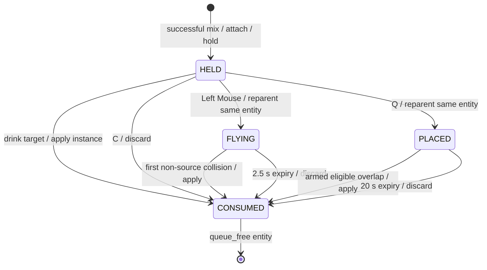

# Project Architecture

> Status: Technical source of truth
> Automated verification: 2026-08-30 with Godot 4.7.2; GUI/manual checks pending
> Creative companion: [Style and Vision](./STYLE_AND_VISION.md)
> Player model guide: [PlayerModel](../characters/player/README.md)
> Visual reference pack: [Art Reference Index](./ART_REFERENCE_INDEX.md)

## Project Scope

CombatAlchemy is a Godot 4.x GDScript prototype. The active game is a
real-time potion combat sandbox reached from the main menu. The current slice
has player movement and collision, actors with reusable health components,
capability-based potion effects, one held physical potion, immediate drinking,
throwing and proximity placement,
mixer UI, scene transitions, music, settings, and pause navigation.

There is no exploration layer, enemy AI, victory state, defeat state,
permanent save data, reagent inventory, or automatic combat-completion return
flow. The next technical goals, in order, are:

1. Add one enemy entity with readable notice, pursuit, telegraph, attack,
   recovery, and potion-reaction states.
2. Add reagent pickups and limited runtime carrying without permanent storage.
3. Add selected world objects with focused capabilities that existing potion
   effects can query.
4. Add victory, defeat, and encounter reset around the proven combat loop.

Exploration, refuge, discovery records, persistence, richer enemy perception,
group behavior, and full expedition routing remain future vision rather than
current runtime architecture. See [Project Goals and Scope](./STYLE_AND_VISION.md#project-goals-and-scope)
for the layered product direction.

The code favors scene-local components. The only autoloads are application
shell services: settings, music, transitions, and scene routing. Potion data,
health, input translation, UI rendering, player presentation, and potion entity
motion remain independent of those autoloads.

## Runtime Flow

```text
project.godot
  -> mainmenu/StartMenu.tscn
	  -> MainMenu: New Game
		  -> GameManager.start_new_game()
			  -> SceneTransition.transition_to_scene()
				  -> combat/CombatScene.tscn

CombatScene
  -> PlayerActor (world movement, camera, collision, health)
	  -> PlayerModel (15-bone visuals, four-facing idle/walk, sockets)
  -> PotionCombatController
	  -> PotionMixer.mix() -> potion_prepared(PotionInstance)
		  -> one PotionEntity attaches to PlayerModel.hand_right
		  -> HeldPotionSlot retains the instance/entity pair
			  -> drink(Player): direct PotionImpactContext
			  -> throw_into(Arena/PotionEntities, origin, direction): FLYING
			  -> place_into(Arena/PotionEntities, position): PLACED
				  -> eligible collision creates PotionImpactContext
			  -> PotionInstance.apply() -> PotionEffectResolver
				  -> recipe effects query subject components

Play Current Scene
  -> characters/player/PlayerModelWorkshop.tscn
```

Escape opens `ui/PauseMenu.tscn`. Resume returns to the same scene; Main Menu
routes through `GameManager`; Quit calls `GameManager.quit_game()`.

## Directory Ownership

| Path | Ownership |
| --- | --- |
| `characters/player/` | Canonical compact player model, locomotion library, sockets, workshop, and model guide. |
| `combat/CombatScene.tscn` | Active potion sandbox composition and dependency wiring. |
| `combat/actors/` | Player movement, actor capabilities, neutral impact hitboxes, collision, cameras, and world health bars. |
| `combat/potions/` | Reagent constants, recipes, unfinished mixer layers, runtime potion instances, one held slot, delivery IDs, and physical potion entities. |
| `combat/potions/effects/` | Stateless effect contracts, delivery context, resolver, and effect implementations. |
| `combat/potions/resources/` | Editable default recipe book and recipe resources. |
| `combat/ui/` | Flask rendering and bottom-center mixer controls. |
| `globals/` | Autoload services and scene-level music declarations. |
| `globals/resources/` | Scene registry and project information resources. |
| `mainmenu/` | Main menu, settings overlay, version plaque, and alchemy decoration. |
| `ui/` | Reusable pause menu. |
| `tests/` | Nine retained headless scene suites for player, potion, and collision behavior. |
| `docs/` | Active architecture, visual direction, and local art references. |
| `music/`, `sprites/`, `extra/` | Audio, remaining images, fonts, and shaders. |

## Scene Composition

### CombatScene

`combat/CombatScene.tscn` is the registered combat scene. Its root owns
`PotionCombatController` and composes:

- `Arena/Player`: `combat/actors/PlayerActor.tscn`, including
  `PlayerCombatController`, `characters/player/PlayerModel.tscn`, collision,
  following camera, `HealthComponent`, neutral `ImpactHitbox`, and
  `ActorHealthBar`.
- `Arena/Friend` and `Arena/Foe`: `TargetActor.tscn` instances with distinct
  visuals and starting health.
- `Arena/PotionEntities`: runtime parent for flying and placed potion entities.
  A newly mixed entity is added here before attachment; while held, its parent
  is the PlayerModel's `hand_right` socket. Release reparents the same node here.
- `Systems/PotionInput`: maps Input Map actions to potion intent signals.
- `Systems/PotionMixer`: owns unfinished reagent layers only; emits a new
  `PotionInstance` on a successful mix.
- `Systems/HeldPotionSlot`: holds references to exactly one instance/entity pair.
- `UI/PotionMixerUI`: displays layers, prepared color, and reagent controls.
- `UI/PauseMenu`: reusable pause and settings overlay.
- `LevelMusic`: requests `music/CombatNew.mp3` from `MusicManager`.

Actors remain present and targetable at zero health. Healing can raise them
above zero. No component changes scenes or decides victory or defeat.

### PlayerActor

`combat/actors/PlayerActor.tscn` owns active player world behavior. The root
`CharacterBody2D` runs `PlayerCombatController.gd`; it contains the canonical
`PlayerModel`, collision, camera, health, neutral impact hitbox, and health
bar. World velocity is passed directly to `PlayerModel.set_motion()`. Throw
origin is the model's `hand_right` socket, with the actor position as a
defensive fallback.

`get_potion_holder()` returns the `hand_right` `Marker2D`, or `null` if absent.
A missing holder rejects a new bottle; only throw-origin lookup falls back to
the actor position. `get_place_position()` is the player world position plus
`get_throw_direction() * place_distance` (default `64.0` pixels). The direction
is measured from the right hand toward the global mouse, with rightward fallback.

### PotionEntity

`combat/potions/PotionEntity.tscn` is one `Node2D` for the entire bottle lifetime.
It owns `BottleVisual` (`Polygon2D`), `Outline` (`Line2D`),
`FlightArea/CollisionShape2D`, `SweepCast` (`ShapeCast2D`), and
`PlacementTrigger/CollisionShape2D`. The flight circle radius is `13` pixels;
the trigger radius is `42` pixels. Flight and sweep masks are `3` (world and
actor layers); placement mask is `2` (actor layer). Both areas have layer `0`.
Held and consumed states disable monitoring and the sweep; flying enables
flight monitoring and sweep; placed enables only placement monitoring.

These are runtime parenting and reference responsibilities, not persistent
inventory or changes to the Godot serialization `owner` property.

### PlayerModel

`characters/player/PlayerModel.tscn` owns presentation only. Its authored
15-bone `Skeleton2D`, geometric body parts, two hand sockets,
`AnimationPlayer`, and `AnimationTree` are directly editable. Four separate
facings (`front`, `back`, `side_left`, `side_right`) each provide idle and walk
clips through `characters/player/PlayerLocomotionLibrary.tres`. Horizontal
facings use authored positive-scale states; they are not mirrored at runtime.

Stable socket IDs are `hand_left` and `hand_right`. Consumers call
`get_socket()` instead of depending on internal bone paths. The complete bone
tree and sprite-replacement contract are in
`characters/player/README.md`.

### PlayerModelWorkshop

`characters/player/PlayerModelWorkshop.tscn` is the isolated Play Current
Scene workshop. `PlayerModelWorkshopActor.gd` owns movement and collision;
`PlayerModel.gd` remains presentation-only; `PlayerModelWorkshop.gd` keeps the
facing, locomotion, and debug-bone controls synchronized. The workshop is not
registered in `project.godot` and is not a runtime dependency of combat.

## Retained Script Reference

Public methods below exclude Godot lifecycle callbacks and private methods
whose names begin with an underscore. `None` means the script intentionally
exposes no item in that category.

### Player And Combat

| Script | Responsibility | Dependencies | Signals | Exports | Public methods |
| --- | --- | --- | --- | --- | --- |
| `characters/player/PlayerModel.gd` | Own compact visual facing, locomotion blending, sockets, and debug bones. | Authored model nodes, required clips, and `AnimationTree` state machines. | `facing_changed`, `locomotion_changed` | None | `set_motion()`, `set_facing_direction()`, `reset_to_idle()`, `set_playback_speed()`, `set_debug_bones_visible()`, `get_facing()`, `get_locomotion_state()`, `get_socket()` |
| `characters/player/PlayerModelWorkshop.gd` | Synchronize workshop status controls with the canonical model. | Workshop `PlayerModel`, labels, and bones toggle. | None | None | None |
| `characters/player/PlayerModelWorkshopActor.gd` | Move and collide the workshop actor while forwarding velocity to the model. | Input Map movement actions and a model exposing `set_motion()`. | None | `movement_speed`, `player_model_path` | None |
| `combat/PotionCombatController.gd` | Coordinate input, unfinished mixing, held ownership, UI, and entity delivery. | `PotionInput`, `PotionMixer`, `HeldPotionSlot`, `PotionMixerUI`, `PlayerCombatController`, entity parent and scene. | None | `potion_input_path`, `potion_mixer_path`, `held_potion_slot_path`, `potion_mixer_ui_path`, `player_combat_controller_path`, `potion_entities_parent_path`, `potion_entity_scene` | None |
| `combat/PotionInput.gd` | Translate named Input Map actions into potion intent. | Project input actions, `PotionReagent`, `PotionDelivery`. | `mixer_toggle_requested`, `reagent_requested(reagent: StringName)`, `mix_requested`, `potion_use_requested(delivery_method: StringName)`, `remove_reagent_requested`, `clear_mixture_requested` | None | None |
| `combat/actors/PlayerCombatController.gd` | Move the active player and provide holder and world-space delivery geometry. | Movement actions and `PlayerModel.set_motion()`/`get_socket()`. | `movement_changed(current_velocity: Vector2)` | `speed`, `player_model_path`, `place_distance` (`64.0`) | `set_movement_locked()`, `is_movement_locked()`, `get_potion_holder() -> Marker2D`, `get_throw_origin() -> Vector2`, `get_throw_direction() -> Vector2`, `get_place_position() -> Vector2` |
| `combat/actors/HealthComponent.gd` | Own bounded actor health. | None. | `health_changed`, `depleted`, `damaged` | `max_health`, `current_health` | `take_damage()`, `heal()`, `reset_health()`, `get_health_ratio()` |
| `combat/actors/ImpactHitbox.gd` | Map a collision-only area to the entity whose components effects may query. | Configured subject node. | Inherited `Area2D` signals | `effect_subject_path` | `get_effect_subject()` |
| `combat/actors/ActorHealthBar.gd` | Display an actor name and exact world-space health values. | Configured `HealthComponent` and scene labels/bar. | None | `display_name`, `health_component_path` | None |
| `combat/potions/PotionReagent.gd` | Define supported reagent IDs and colors. | None. | None | None | Static `is_valid()`, `get_color()` |
| `combat/potions/PotionRecipeData.gd` | Describe one exact three-layer potion recipe and its composable effects. | `PotionReagent`, `PotionEffectData`. | None | ID, name, three counts, effects, mixed color | `is_valid()`, `matches_layers()` |
| `combat/potions/PotionRecipeBookData.gd` | Find an order-independent recipe match. | `PotionRecipeData` resources. | None | `recipes` | `find_match()` |
| `combat/potions/PotionMixer.gd` | Collect unfinished layers and create a runtime instance. | `PotionReagent` and configured `PotionRecipeBookData`. | `layers_changed(layers: Array[StringName])`, `potion_prepared(potion: PotionInstance)`, `mix_rejected(layers: Array[StringName])`, `mixture_cleared` | `max_layers` (`3`, clamped `1..3`), `recipe_book` | `add_reagent(reagent: StringName) -> bool`, `remove_last() -> bool`, `clear() -> void`, `mix() -> bool`, `get_layers() -> Array[StringName]` |
| `combat/potions/PotionInstance.gd` | Own one valid recipe reference, copied creation layers, and one-shot consumption state. | `PotionRecipeData`, `PotionImpactContext`, `PotionEffectResolver`. | None | None | Static `create(recipe: PotionRecipeData, layers: Array[StringName]) -> PotionInstance`; `get_recipe() -> PotionRecipeData`, `get_created_layers() -> Array[StringName]`, `get_color() -> Color`, `is_valid() -> bool`, `is_consumed() -> bool`, `apply(context: PotionImpactContext) -> int`, `discard() -> bool` |
| `combat/potions/HeldPotionSlot.gd` | Retain the one currently held instance/entity pair. | `PotionInstance`, `PotionEntity`. | `potion_changed(potion: PotionInstance)` (null on clear) | None | `hold(potion: PotionInstance, entity: PotionEntity) -> bool`, `clear() -> void`, `has_potion() -> bool`, `get_potion() -> PotionInstance`, `get_entity() -> PotionEntity` |
| `combat/potions/PotionEntity.gd` | Own one bottle through `HELD`, `FLYING`, `PLACED`, `CONSUMED` states. | `PotionInstance`, `PotionDelivery`, `PotionImpactContext`, scene visuals and collision nodes. | `state_changed(state: State)`, `resolved(context: PotionImpactContext, applied_effect_count: int)` | `flight_speed` (`650.0` px/s), `flight_lifetime` (`2.5` s), `arming_delay` (`0.35` s), `placed_lifetime` (`20.0` s) | `initialize(potion: PotionInstance, source: Node) -> bool`, `attach_to(holder: Node2D) -> bool`, `drink(target: Node) -> bool`, `throw_into(world_parent: Node2D, origin: Vector2, direction: Vector2) -> bool`, `place_into(world_parent: Node2D, world_position: Vector2) -> bool`, `discard() -> bool`, `get_state() -> State`, `get_potion() -> PotionInstance` |
| `combat/potions/PotionDelivery.gd` | Share `StringName` delivery constants `DRINK = &"drink"`, `THROW = &"throw"`, `PLACE = &"place"`. | None. | None | None | None |
| `combat/potions/effects/PotionEffectData.gd` | Define the stateless base contract and application result values for one effect. | `PotionImpactContext`. | None | None | `is_valid()`, `apply()` |
| `combat/potions/effects/HealthPotionEffectData.gd` | Heal or damage an impacted subject when it exposes `HealthComponent`. | `PotionEffectData`, `PotionImpactContext`, `HealthComponent`. | None | `operation`, `amount` | `is_valid()`, `apply()` |
| `combat/potions/effects/PotionImpactContext.gd` | Carry delivery source, subject, collider, world geometry, and direct-child capability lookup. | Impacted scene nodes. | None | None | `configure()`, `is_valid()`, `find_component()` |
| `combat/potions/effects/PotionEffectResolver.gd` | Apply every valid recipe effect and count supported applications. | `PotionRecipeData`, `PotionEffectData`, `PotionImpactContext`. | None | None | `apply_recipe()` |
| `combat/ui/FlaskView.gd` | Render layers, a completed mixture, and failed-mix feedback. | Child polygons/outline and `PotionReagent` colors. | None | None | `set_layers()`, `show_mixed()`, `show_failure()`, `reset_view()` |
| `combat/ui/PotionMixerUI.gd` | Present reagent controls and reflect mixer state. | `FlaskView` and three reagent buttons. | `reagent_selected` | None | `set_open()`, `show_mixing()`, `show_ready()`, `show_mix_failure()`, `reset_view()` |

### Application Shell

| Script | Responsibility | Dependencies | Signals | Exports | Public methods |
| --- | --- | --- | --- | --- | --- |
| `globals/GameManager.gd` | Route high-level actions to registered scenes. | `SceneRegistryData`, `SceneTree`, optional `SceneTransition`. | None | `use_ink_transition`, `scene_registry` | `start_new_game()`, `go_to_main_menu()`, `quit_game()` |
| `globals/Settings.gd` | Persist and apply Music/SFX bus levels. | `AudioServer`, `user://settings.cfg`. | None | None | `set_music_db()`, `set_sfx_db()`, `apply_audio()`, `save_settings()`, `load_settings()` |
| `globals/MusicManager.gd` | Own persistent scene music and crossfades. | `LevelMusic` nodes and requested audio bus. | Inherited `AudioStreamPlayer.finished` | `default_volume_db` | `crossfade_to()` |
| `globals/InkwashTransition.gd` | Change scenes behind a captured ink-wash snapshot. | Snapshot `TextureRect`, `ShaderMaterial`, and `SceneTree`. | `transition_finished` | `ink_reveal_time`, `transition_snapshot_path` | `is_busy()`, `set_transition_duration()`, `transition_to_scene()` |
| `globals/LevelMusic.gd` | Describe a scene's music request. | `AudioStream` and named audio bus. | None | `music`, `volume_db`, `crossfade`, `loop`, `bus` | `get_music()`, `get_crossfade()`, `get_loop()`, `get_volume_db()`, `get_bus()` |
| `globals/resources/SceneRegistryData.gd` | Register main-menu and combat scenes. | `PackedScene`. | None | `main_menu_scene`, `combat_scene` | None |
| `globals/resources/ProjectInfoData.gd` | Supply main-menu project metadata. | None. | None | `project_version`, `current_focus`, `build_label`, `show_focus`, `show_build_label` | None |
| `mainmenu/MainMenu.gd` | Coordinate menu controls, styling, settings visibility, and game start/quit. | `GameManager`, `SceneTransition`, `SettingsMenu`, `AlchemySeal`, `MainMenuStyleData`. | None | `transition_duration`, `menu_style` | None |
| `mainmenu/SettingsMenu.gd` | Synchronize audio sliders with persistent settings. | `Settings` autoload and menu controls. | `close_requested` | None | None |
| `mainmenu/VersionStone.gd` | Present project version and focus metadata. | Labels and optional `ProjectInfoData`. | None | `project_info` | None |
| `mainmenu/AlchemySeal.gd` | Draw and animate the decorative menu seal. | `CanvasItem` drawing. | None | Geometry, animation, and appearance tuning values | None |
| `mainmenu/resources/MainMenuStyleData.gd` | Store main-menu visual tuning. | Optional background texture. | None | Background, seal, shader, vignette, and pulse values | None |
| `ui/PauseMenu.gd` | Own pause input, settings navigation, resume, menu routing, and quit. | `SettingsMenu`, `GameManager`, and `ui_cancel`. | None | None | None |

### Test Runners

| Script | Responsibility | Dependencies | Signals | Exports | Public methods |
| --- | --- | --- | --- | --- | --- |
| `tests/PlayerModelTests.gd` | Validate the 15-bone model, animations, facings, sockets, bounds, public behavior, and dependency failures. | `PlayerModel.tscn` and player model resources. | None | None | None |
| `tests/PlayerModelWorkshopTests.gd` | Validate workshop composition, controls, movement, collision, camera, and debug bones. | `PlayerModelWorkshop.tscn`. | None | None | None |
| `tests/PlayerActorTests.gd` | Validate active player composition, movement/model forwarding, and throw origin/fallback. | `PlayerActor.tscn` and `PlayerModel`. | None | None | None |
| `tests/PotionInstanceTests.gd` | Validate instance creation, defensive layer copies, one-shot application/discard, delivery IDs, and held-slot ownership. | Potion instance, slot, entity, and effect scripts. | None | None | None |
| `tests/PotionDomainTests.gd` | Validate reagents, recipes, mixer signals/state, health, and movement lock. | Potion-domain and actor scripts. | None | None | None |
| `tests/PotionEffectPipelineTests.gd` | Validate impact subjects, recipe effect validation, health capability application, unsupported objects, and independent mixed-effect ordering. | Effect scripts, `ImpactHitbox`, and `HealthComponent`. | None | None | None |
| `tests/PotionEntityTests.gd` | Validate held attachment, entity identity, state transitions, drink/discard, flight and placement expiry, and rejected transitions. | `PotionEntity.tscn` and potion instance/effect scripts. | None | None | None |
| `tests/PotionEntityCollisionTests.gd` | Validate swept flight, actor/wall impacts, source exclusion, placement arming, stationary overlap, source exit/re-entry and first entry from outside, unsupported subjects, and expiry. Includes idle placement with production physics enabled at normal and zero arming delay. | `PotionEntity`, `ImpactHitbox`, physics bodies, and health data. | None | None | None |
| `tests/PotionUseTests.gd` | Validate drink/throw/place input, same bottle identity, slot clearing, UI closure, held-potion Tab gating, discard, and input with an empty slot. | `CombatScene.tscn` and potion/player runtime components. | None | None | None |

## Potion Data Flow

### Recipe, Instance, And Entity

`PotionRecipeData` is shared immutable configuration: exact reagent counts,
mixed color, and stateless effect resources. `PotionInstance` is a unique
`RefCounted` runtime preparation referencing that recipe, preserving a defensive
copy of the ordered creation layers, and recording whether it was consumed.
`PotionEntity` is the physical scene node that carries that same instance.
Two bottles may share a recipe, but never share their consumption state.

`PotionInstance.apply(context)` validates the instance and context, then marks
the instance consumed before resolving effects. It returns the supported-effect
count; zero supported effects still consumes a valid application. Invalid or
repeated application returns zero without applying effects. `discard()` marks
it consumed without effects. `is_valid()` checks preparation validity separately
from `is_consumed()`.

### Mixing And One Held Slot

1. `PotionInput` converts one handled Input Map action into one signal.
   Drink, throw, and place share `potion_use_requested(delivery_method)`.
2. `PotionCombatController` accepts reagent edits and mixing only while the
   mixer is open and `HeldPotionSlot` is empty. Tab is ignored while holding.
3. `PotionMixer` validates reagent IDs and asks `PotionRecipeBookData` for an
   order-independent exact three-layer match. Rejection preserves layers.
4. Success creates a fresh `PotionInstance`, clears unfinished layers, then
   emits `layers_changed`, `mixture_cleared`, and `potion_prepared(instance)`
   in that order. The mixer retains no finished preparation.
5. The controller instantiates `potion_entity_scene` once, validates its type,
   adds it to `Arena/PotionEntities`, calls `initialize(instance, Player)`,
   attaches it to the right-hand holder, then calls `HeldPotionSlot.hold()`.
   The slot requires an empty slot, a valid unused instance, and an entity
   referencing that instance. The mixer stays open with the completed color.
6. If construction, attachment, or holding fails, the new instance is discarded,
   the candidate is cleaned up, and the empty mixer stays open. No orphaned
   preparation remains available for use.

### Bottle Lifecycle



The PNG companion `PROJECT_ARCHITECTURE_DIAGRAM.png` was not updated or
visually verified on 2026-08-30: direct image inspection failed with the
Windows sandbox deny-read ACL error. The existing PNG and import metadata
remain untouched; this Markdown describes the verified runtime lifecycle.

### Drink, Flight, And Placement

- **Drink:** Right Mouse calls the held entity's `drink(Player)`. It creates a
  `PotionImpactContext` with Player as subject and collider, the original source,
  Player world position, upward direction, and `PotionDelivery.DRINK`.
  The entity applies its instance, becomes consumed, emits `resolved`, and
  queues itself for deletion.
- **Throw:** Left Mouse calls `throw_into(Arena/PotionEntities, origin, direction)`.
  It reparents the held node, preserving identity, to the world parent and
  starts flight at the right-hand origin. Flight moves at `650` px/s, sweeps
  the full frame travel before movement, and consumes on the nearest detected
  non-source body/area collision or after `2.5` seconds. The source and its
  descendant collision objects are excluded. Impact uses `PotionDelivery.THROW`.
- **Place:** Q calls `place_into(Arena/PotionEntities, get_place_position())`.
  It reparents the same node `64` pixels from Player position in the hand-to-cursor
  aim direction. It does not raycast or clamp placement to walls. The bottle
  arms after `0.35` seconds and expires `20` seconds after placement.
  At arming, it chooses the nearest eligible currently overlapping collider;
  later eligible entries trigger immediately. The trigger monitors the actor
  layer, not ordinary world walls.
- **Source overlap:** after deferred monitoring activation, placement waits for
  a completed physics step and its overlap-query flush before initializing the
  source gate. Monitoring alone does not mean the overlap list is current.
  Source bodies/areas initially inside the trigger remain ineligible until all
  source overlaps leave; re-entry can then trigger the bottle. If the source
  starts outside, its first later entry is eligible.
  Other actors may trigger after arming even while the source remains inside.
  Placement context uses `PotionDelivery.PLACE` and the subject world position.
- **Successful release/use:** the controller clears the held slot and closes
  the mixer only when the entity method succeeds. The slot's `clear()` releases
  references; it does not itself consume, free, or reparent an entity.
  A rejected delivery leaves the held potion available. C discards a held
  bottle, clears layers and slot, and keeps the empty mixer open.

`ImpactHitbox.get_effect_subject()` maps actor collision areas to their entity;
ordinary bodies are their own effect subject. `PotionImpactContext` carries
`subject`, `collider`, `source`, `world_position`, normalized `direction`, and
a `StringName delivery_method`. Its `configure(...)` returns the context,
`is_valid()` requires a live subject, and `find_component(script)` searches the
subject and its direct children.

`PotionEffectResolver` attempts every valid recipe effect independently.
An effect applies only when the subject exposes its required capability.
A wall without `HealthComponent` therefore consumes a thrown health potion
with zero health effects. `resolved(context, applied_effect_count)` is emitted
for a context-based resolution, including zero applications; discard/expiry
does not emit it. No animation event delays, owns, commits, or cancels use.

### Future Inventory And Storage Boundary

The current system has one held slot, unfinished mixer layers, and temporary
world entities. It has no potion inventory, pickup/recovery, stacking, multiple
held slots, storage container, save/load serialization, or persistence across
scene changes. Settings persistence is unrelated to potion storage.

A future inventory should own and transfer unused `PotionInstance` values
without moving consumption state into shared recipe resources. Physical scene
attachment belongs to `PotionEntity`; the mixer remains a creator of instances,
not a storage service. Save formats, inventory UI, and transfer rules are not
implemented by this slice.

## Default Recipes

| Resource | Layers, any order | Effect |
| --- | --- | --- |
| `combat/potions/resources/HealthPotion.tres` | red, red, blue | `effects/Heal30.tres` |
| `combat/potions/resources/DamagePotion.tres` | green, green, blue | `effects/Damage30.tres` |

`PotionRecipeBook_Default.tres` lists both recipe resources. To add a recipe,
create a valid `PotionRecipeData` with exactly three total layers and at least
one valid `PotionEffectData`, then append it to that book.

To add a new effect family such as shape modification:

1. Add a focused component to subjects that support the behavior, for example
   `ShapeModifierComponent` with a small public API.
2. Add a stateless `PotionEffectData` subclass whose `apply()` asks the context
   for that component and returns `UNSUPPORTED` when absent.
3. Create an editable effect resource and add it to one or more recipe
   `effects` arrays. Do not modify `PotionEntity` or add an effect switch to
   `PotionCombatController`.

Shared effect resources must remain immutable at runtime. Timed or stateful
effects should ask a target component to create and own their runtime state.

## Input Actions

| Action | Default input | Owner |
| --- | --- | --- |
| `move_up`, `move_down`, `move_left`, `move_right` | W/S/A/D and arrows | `PlayerCombatController`, workshop actor |
| `toggle_mixer` | Tab | `PotionInput` |
| `add_red_reagent`, `add_green_reagent`, `add_blue_reagent` | 1/2/3 | `PotionInput` |
| `mix_potion` | Space | `PotionInput` |
| `drink_potion` | Right Mouse | `PotionInput` |
| `throw_potion` | Left Mouse | `PotionInput` |
| `place_potion` | Q | `PotionInput` |
| `remove_reagent` | Backspace | `PotionInput` |
| `clear_mixture` | C | `PotionInput` |
| `ui_cancel` | Escape | `PauseMenu` |

## Verification

Godot `4.7.2.stable.steam.ed1daf0bf` was observed on 2026-08-30.
The GUI-subsystem executable is launched through `ProcessStartInfo` and
`WaitForExit` so exit codes and complete output are observable. Both the
positional CombatScene path below and explicit `--scene` test paths worked.
Verbose smokes confirmed CombatScene and the project's StartMenu actually loaded.

### Import And Scene Smokes

```powershell
$godot = 'D:\SteamLibrary\steamapps\common\Godot Engine\godot.windows.opt.tools.64.exe'

function Invoke-GodotWait([string]$arguments) {
	$psi = [System.Diagnostics.ProcessStartInfo]::new()
	$psi.FileName = $godot
	$psi.Arguments = $arguments
	$psi.WorkingDirectory = (Get-Location).Path
	$psi.UseShellExecute = $false
	$psi.CreateNoWindow = $true
	$psi.RedirectStandardOutput = $true
	$psi.RedirectStandardError = $true
	$process = [System.Diagnostics.Process]::Start($psi)
	$stdoutTask = $process.StandardOutput.ReadToEndAsync()
	$stderrTask = $process.StandardError.ReadToEndAsync()
	if (-not $process.WaitForExit(60000)) {
		$process.Kill()
		$process.WaitForExit()
		throw "Godot timed out: $arguments"
	}
	Write-Output ($stdoutTask.Result.TrimEnd())
	Write-Output ($stderrTask.Result.TrimEnd())
	Write-Output "Exit code: $($process.ExitCode)"
	if ($process.ExitCode -ne 0) {
		throw "Godot exited $($process.ExitCode): $arguments"
	}
}

Invoke-GodotWait '--headless --editor --quit --path .'
Invoke-GodotWait '--headless --fixed-fps 60 --quit-after 120 --path . res://combat/CombatScene.tscn'
Invoke-GodotWait '--headless --fixed-fps 60 --quit-after 120 --path .'
```

Observed: all three processes exited `0` with no parser, missing-resource,
or duplicate-UID diagnostics. Editor import had empty stderr. Each forced
scene shutdown reported `2 ObjectDB instances were leaked` and
`1 resources still in use at exit`. Additional `--verbose` runs (also exit `0`)
identified `AudioStreamMP3` and `AudioStreamPlaybackMP3`, with
`res://music/CombatNew.mp3` and `res://music/MainMenuNew.mp3` respectively.
These are retained shutdown diagnostics, not missing-resource failures;
the smokes are not described as error-free.

### Retained Test Scenes

Run each suite through the same `Invoke-GodotWait` helper:

```powershell
Invoke-GodotWait '--headless --fixed-fps 60 --path . --scene res://tests/PlayerModelTests.tscn'
Invoke-GodotWait '--headless --fixed-fps 60 --path . --scene res://tests/PlayerModelWorkshopTests.tscn'
Invoke-GodotWait '--headless --fixed-fps 60 --path . --scene res://tests/PlayerActorTests.tscn'
Invoke-GodotWait '--headless --fixed-fps 60 --path . --scene res://tests/PotionInstanceTests.tscn'
Invoke-GodotWait '--headless --fixed-fps 60 --path . --scene res://tests/PotionDomainTests.tscn'
Invoke-GodotWait '--headless --fixed-fps 60 --path . --scene res://tests/PotionEffectPipelineTests.tscn'
Invoke-GodotWait '--headless --fixed-fps 60 --path . --scene res://tests/PotionEntityTests.tscn'
Invoke-GodotWait '--headless --fixed-fps 60 --path . --scene res://tests/PotionEntityCollisionTests.tscn'
Invoke-GodotWait '--headless --fixed-fps 60 --path . --scene res://tests/PotionUseTests.tscn'
```

Observed output on 2026-08-30 (all nine exited `0`):

- `PlayerModelTests: PASS (469 checks)`
- `PlayerModelWorkshopTests: PASS (41 checks)`
- `PlayerActorTests: PASS (28 checks)`
- `PotionInstanceTests: PASS (37 checks)`
- `PotionDomainTests: PASS (17 tests)`
- `PotionEffectPipelineTests: PASS (20 checks)`
- `PotionEntityTests: PASS (54 checks)`
- `PotionEntityCollisionTests: PASS (119 checks)`
- `PotionUseTests: PASS (89 checks)`

Total: `857 checks` plus `17 domain tests`. `PlayerModelTests` deliberately
reports missing `HandSocket_L` and `HandSocket_R` from its dependency-failure
fixtures. The other eight suite stderr logs are empty. These runs include
automated input and physics coverage but do not establish GUI appearance,
audible music, or manual interaction quality.

The collision regression includes idle placement without prewarming or disabling
production physics, at both `0.35` and `0.0` seconds arming delay. It checks
initial source immunity, source exit/re-entry, first entry from outside, and an
already-overlapping non-source while the source stays inside. Competing eligible
overlap selection, held-reagent rejection, and entity construction/attachment
failure cleanup are not covered by these retained suites.

### Static Validation

The obsolete-interface scan of `combat/`, `tests/`, `project.godot`, and this
document returned no matches (ripgrep exit `1`, meaning no matches).
Validation of quoted `res://` paths in `.gd`, `.tscn`, `.tres`, `.godot`, and
`.gdshader` files inspected `85` source files, `128` reference occurrences,
and `87` unique paths: zero missing paths. Dynamic paths and serialized
`uid://` identifiers are outside that literal-path check; editor import
separately checked resource loading.

`git diff --check` exited `0`. SHA-256 comparison of the `232` existing
tracked/untracked files found only this Markdown changed by Task 5.
The existing diagram, import metadata, `STYLE_AND_VISION.md`, and unrelated
capability-pipeline work were preserved. These results describe the tested
working tree, including that pre-existing uncommitted pipeline work, rather
than a clean checkout of the documentation commit alone.

### Manual Godot Checklist

Status on 2026-08-30: every item below is **pending**, not manually verified.
The controller's Computer Use session could not start because of Windows
sandbox deny-read ACLs, including its reset/retry.

1. Open `characters/player/PlayerModel.tscn`. Verify the 15 bones, geometric
   parts, both hand sockets, `AnimationPlayer`, and `AnimationTree` are
   directly editable.
2. Play `PlayerModelWorkshop.tscn` as the current scene. Exercise all eight
   movement directions, stop in every facing, collide with all four walls,
   and toggle debug bones.
3. Start New Game. Verify combat displays the compact model, the camera follows
   it, arena collision blocks movement, and the health bar follows.
4. Open the mixer with Tab; mix red, red, blue. Confirm one bottle appears at
   the right hand and follows it while walking in each facing.
5. Use Right Mouse while Player is below maximum health. Confirm immediate
   healing, bottle removal, mixer closure, and no duplicate use on another press.
6. Mix green, green, blue; use Left Mouse. Confirm the same bottle leaves the
   hand, flies toward the cursor, and damages Friend or Foe.
7. Throw into empty space and confirm expiry after `2.5` seconds. Throw at a
   wall and confirm consumption with no health reaction.
8. Mix another potion; press Q. Confirm the same bottle is placed `64` pixels
   from Player in the aim direction, clears the held slot, and closes the mixer.
9. Confirm it waits `0.35` seconds before triggering another actor, ignores
   Player's initial overlap, and expires after `20` seconds if unused.
10. With a surviving placed healing potion fixture initially overlapping Player,
	step fully away and back after arming; confirm source re-entry is eligible.
	Ensure Player has missing health so the reaction is visible.
11. Press C while holding. Confirm the bottle is discarded, the held slot and
	unfinished layers clear, and the empty mixer stays open.
12. Verify Tab and reagent/mix edits are blocked while holding; Tab toggles the
	empty mixer normally. Confirm mixing and use do not lock movement.
13. Verify movement, camera following, arena collision, pause, settings, resume,
	music playback, and Main Menu/New Game routing.
14. Resize to a smaller 16:9 window and verify the mixer and world remain usable.

## Change Guidelines

- Keep `PlayerModel` presentation-only; world movement, collision, camera, and
  health belong to `PlayerActor` and its actor components.
- Preserve the 15-bone hierarchy, authored four-facing clips, positive model
  scale, and stable socket IDs when replacing geometric parts with sprites.
- Keep delivery coordination in `PotionCombatController`, physical lifecycle
  in `PotionEntity`, and one-shot application in `PotionInstance`; animation is
  visual feedback and must not own gameplay outcomes.
- Keep recipe matching in resource data and mixer code, not scene controllers
  or UI scripts.
- Keep health reusable and free of scene routing or victory decisions.
- Keep collision consumption separate from effect support. A bottle impact
  must not require a health component or a universal potion receiver.
- Add new potion behavior through effect resources and focused capability
  components, not central effect-type switches.
- Add new routed scenes through `SceneRegistryData` and `GameManager`.
- Keep developer workshops out of `project.godot` runtime routing.
- Add or update focused headless scene coverage when a public contract changes.
