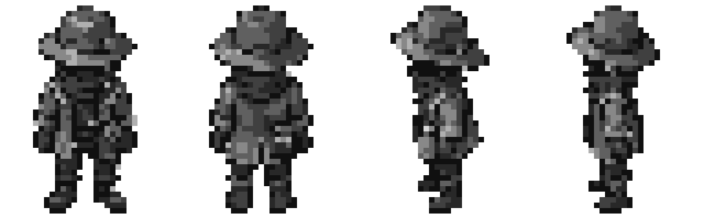
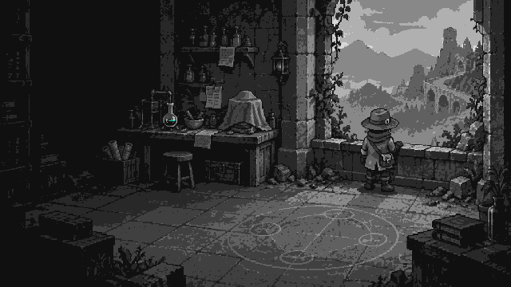

# CombatAlchemy Pixel-Art Approval Pack

> Generated: 2026-09-12
> Status: Researcher facings and main-menu composition approved on 2026-09-12.
> Production status: Researcher samples remain concept references. The menu
> sample informed composition only; the active menu uses a separate native
> `1920 x 1080` redraw under `sprites/main_menu/animated/`.
> Plan: [Pixel-Art Conversion](../plannings/plans/2026-09-12-pixel-art-conversion.md)

## Purpose

This pack tests whether the researcher reads at compact scale and whether that
visual language works for the menu. Gameplay composition is intentionally
undecided and has no local approval sample yet.
Large source files are built-in image-generation outputs. `*_NATIVE_*` files
are exact-size review derivatives; `*_PREVIEW_*` files enlarge them by pixel
replication. AI details still need deliberate native-grid cleanup.

## A01: Researcher Facings

Native `128 x 40` sheet with four `32 x 40` cells:

Exact 8x enlargement:

Review identity, four facings, stable feet, empty hands, equipment side, and
suitability for two idle plus four walk frames. This is not a final sprite sheet.

## A03: Main-Menu Composition

Historical `640 x 360` composition sample:

Exact 2x enlargement:

This sample established title/command space, researcher silhouette, grayscale
dominance, and restrained alchemy geometry. It is not upscaled or referenced by
the active menu. Text and controls remain scene-authored in Godot.

## Approval Checklist

- [x] Researcher is recognizable at `32 x 40`.
- [x] Four facings preserve identity, anatomy, lighting, and equipment side.
- [x] Saturated color is reserved for alchemical information.
- [x] The menu direction is suitable for later comparison with an undecided
  gameplay composition.
- [x] The direction warrants manual pixel cleanup and animation production.

Approval covers the retained researcher-facing sample and the main-menu sample''s
composition. It does not approve gameplay composition or establish production
character/flask dimensions. Gameplay presentation must still be decided and
approved separately.

## Production Notes

Prompts followed the [Image Generation Kit](../STYLE_AND_VISION.md#image-generation-kit)
and excluded painterly texture, gradients, anti-aliasing, 3D, anime, colored
ordinary materials, text, watermarks, old combat motifs, excessive particles,
bloom, and UI clutter. The built-in image generator was used; no API-key CLI
was used.

Researcher derivatives crop each pose, fit it in `32 x 40`, threshold alpha,
and map opaque pixels to eight grays. The menu derivative center-crops to 16:9,
resizes to `640 x 360`, maps ordinary pixels to eight grays, and retains only
strong alchemical accents. Enlarged previews replicate pixels exactly. These
operations test scale and palette; production still requires pixel-by-pixel
cleanup and consistent animation frames.
